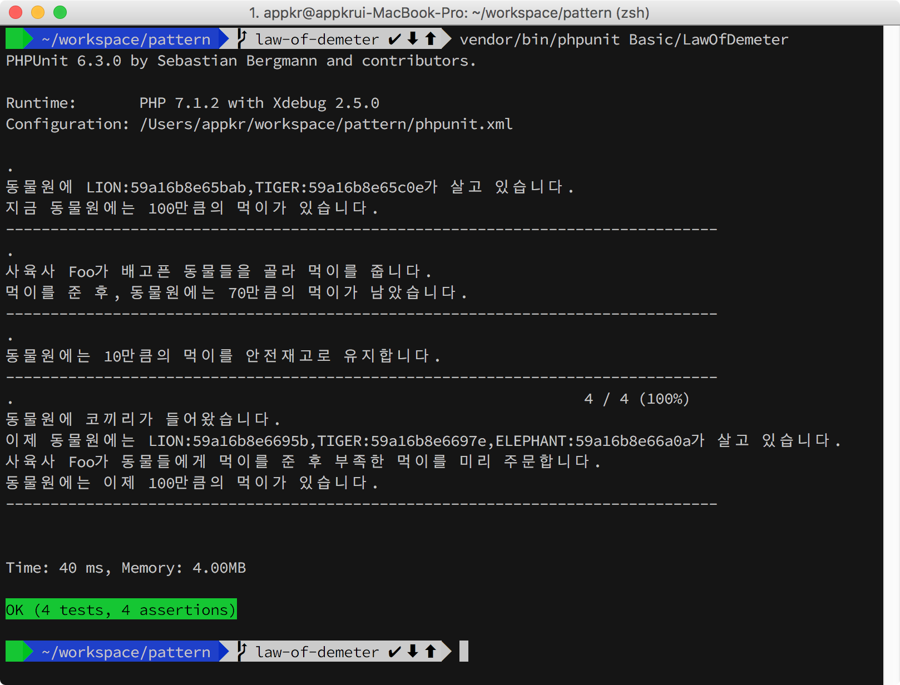
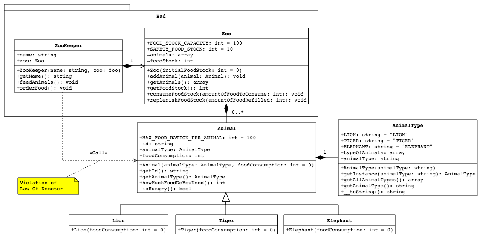
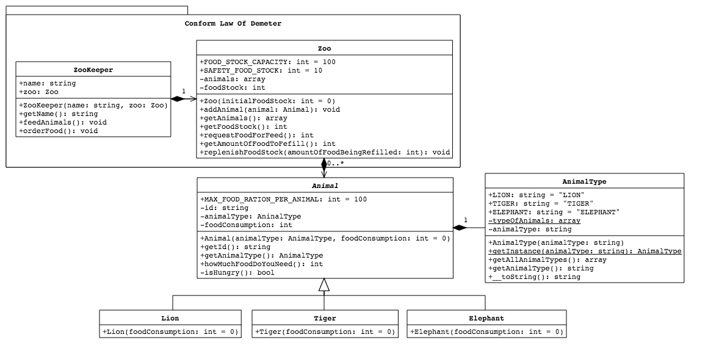

## Law of Demeter

흔히 Least Information 원칙이라고도 합니다. 디자인 원칙 101은 "결합도는 낮추고, 응집도는 높이라"는 것인데, 목적한 바를 이루기 위해 꼭 필요한 정보(의존)만 가져야 한다는 원칙입니다. 흔히 집합을 클래스의 필드로 가진 경우에, 이 원칙을 어길 가능성이 큽니다.

LoD는 Tell Don't Ask와 Command Query Separation 디자인 원칙을 지키기 위한 구체적인 실천 방법을 제시합니다. 

LoD는 `O.m()` 메서드는 아래 열거한 다섯 가지보다 더 많은 내용을 알아서는 안된다고 가이드합니다. 

1. `O` 자신
2. `m`의 파라미터
3. `m`에서 생성된 객체
4. `O`가 필드로 가진 객체
5. `O.m()` 스코프에서 접근할 수 있는 전역 변수

참조: https://en.wikipedia.org/wiki/Law_of_Demeter 

### 1. 설치 및 실행

```bash
~/pattern $ composer install
~/pattern $ vendor/bin/phpunit Basic\LawOfDemeter
```



### 2. 시나리오

사육사가 동물원에서 여러 동물들을 사육하는 시나리오입니다. 

#### 사육사

- 자신이 일하는 동물원을 필드로 가지고 있습니다.
- 동물들에게 먹이를 주고, 동물원 먹이 창고에 먹이가 부족하면 먹이를 주문하고 보충할 책임이 있습니다.

#### 동물원

- 동물들의 집합을 클래스 필드로 가지고 있습니다.
- 동물에게 먹일 남은 '먹이의 양'이란 상태를 가지고 있습니다. 
- 동물들의 먹이를 보관하고 관리할 책임이 있습니다.

#### 동물

- `LION`, `TIGER` 등 동물 종을 식별하는 값을 가지고 있습니다.
- 한 번에 먹을 수 있는 '먹이의 양'이란 속성을 가지고 있습니다.
- 이 예제에서는 단순화를 위해 동물들의 '배고픔'이란 상태는 구현하지 않았으며, `isHungry(): bool` 함수에서 랜덤 값을 반환하고 있습니다.

### 3. 나쁜 코드

`ZooKeeper::feedAnimals()` 함수에서 `Animal::howMuchDoYouNeed()` 함수를 호출하고 있습니다. `Animal` 집합은 `ZooKeeper`가 직접 연관된 필드가 아니며, `Zoo`가 가지고 있는 속성데도 말이죠. 다시 말하면, `a.b().c()`와 같은 호출이 발생한 겁니다.

```php
<?php // Basic/LawOfDemeter/src/Bad/ZooKeeper.php

class ZooKeeper
{
    public function feedAnimals()
    {
        $requiredFood = array_reduce(
            $this->zoo->getAllAnimals(),
            function (int $carry, Animal $animal) {
                return $carry + $animal->howMuchFoodDoYouNeed();
            },
            $initial = 0
        );

        $currentFoodStockInTheZoo = $this->zoo->getFoodStock();

        // Tell Don't Ask 원칙도 위반하고 있습니다.
        if ($requiredFood > $currentFoodStockInTheZoo) {
            throw new Exception(
                "식량이 부족합니다. 식량을 주문해 주세요. 
                요구량: {$requiredFood}, 보유량: {$currentFoodStockInTheZoo}"
            );
        }

        $this->zoo->consumeFoodStock($requiredFood);
    }
}
```



### 3. 디자인 원칙 준수

`a.b().c()`가 해결하고자 했던 문제를, `a` 클래스에 `d()`라는 함수를 정의해서 해결합니다. 클래스 필드에 담긴 객체가 직접 가지고 있는 함수와 속성만 접급한다고 기억하면 쉽습니다. 코드 중에 객체연산자(`->`, `.`)이 여러 번 연속해서 나오면 LoD 위반이 아닌가 살펴봐야 합니다(태생적으로 객체연산자를 붙여 쓰는 빌더 패턴등과 구분할 것).

```php
<?php // Basic/LawOfDemeter/src/ZooKeeper.php

class ZooKeeper
{
    public function feedAnimals()
    {
        try {
            $amountOfFoodToFeed = $this->zoo->requestFoodForFeed();
        } catch (Exception $e) {
            throw $e;
        }
    }
}

// Basic/LawOfDemeter/src/Zoo.php

class Zoo
{
    public function requestFoodForFeed()
    {
        $requiredFood = array_reduce(
            $this->animals,
            function (int $carry, Animal $animal) {
                return $carry + $animal->howMuchFoodDoYouNeed();
            },
            $initial = 0
        );

        if ($requiredFood > $this->foodStock) {
            throw new Exception(
                "식량이 부족합니다. 식량을 주문해 주세요. 
                요구량: {$requiredFood}, 보유량: {$this->foodStock}"
            );
        }

        return $this->foodStock -= $requiredFood;
    }
}
```



### 4. 라라벨

특히 엘로퀀트 모델은 모델 간의 관계를 통해 집합의 집합의 집합의... 관계로 이어지는데요. LoD를 잘 이해하지 못하던 시절, 제가 쓴 많은 코드에 이런 흔적들이 남아 있습니다. 반성합니다~
