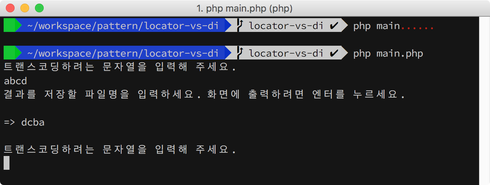
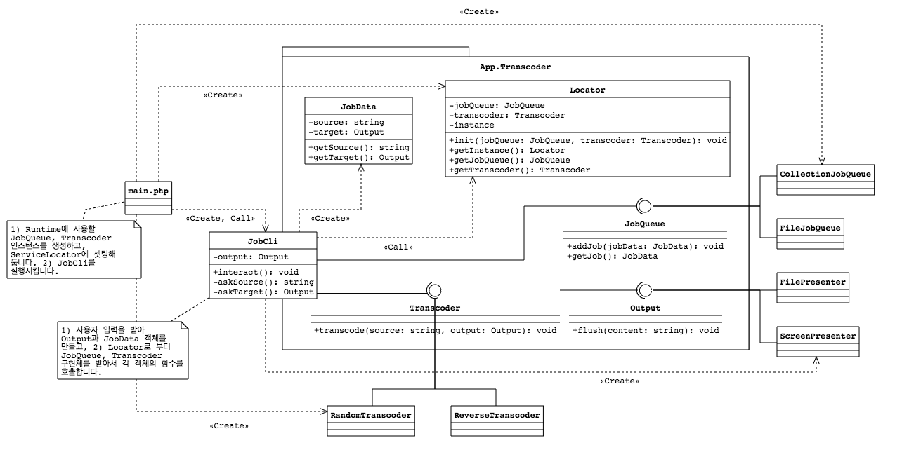

## Service Locator

서비스 로케이터 구현을 연습하기 위한 프로젝트입니다.

### 1. 가상의 시나리오

콘솔을 통해 사용자로부터 입력 받은 문자열을 뒤집거나, 셔플하고, 결과를 화면이나 파일에 저장하는 예제입니다.



예제에서는 문자열 연산이므로 작업이 금방 끝나지만, 비디오 트랜스코딩등 시간이 오래 걸리는 작업을 염두에 두고, 큐를 이용한 비동기 처리를 염두해 두고 확장 가능한 모양으로 구현했습니다. 

그러나, 안타깝게도 PHP는 싱글 쓰레드로 작동하며, [`pthread`](http://php.net/manual/en/book.pthreads.php) 확장모듈을 포함해서 PHP 런타입을 다시 컴파일하지 않으면 워커를 이용한 멀티 쓰레드 병렬 연산이 불가합니다. 그럼에도 불구하고, 외부 메시지 큐를 이용해서 다른 프로세스에서 병렬 처리하는 것은 가능하므로 워커 구현을 남겨 두었습니다(별 의미는 없습니다).

### 2. Service Locator

애플리케이션 작동에 필요한 구현체를 런타임에 구할 수 있도록 고안된 클래스입니다. 

```bash
~/pattern $ composer install
~/pattern $ php Basic/ServiceLocator/main.php
```


