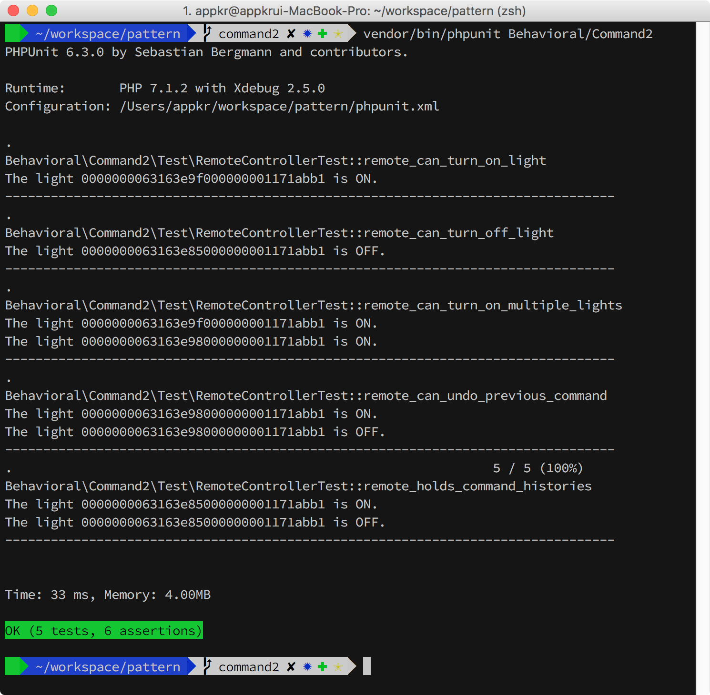
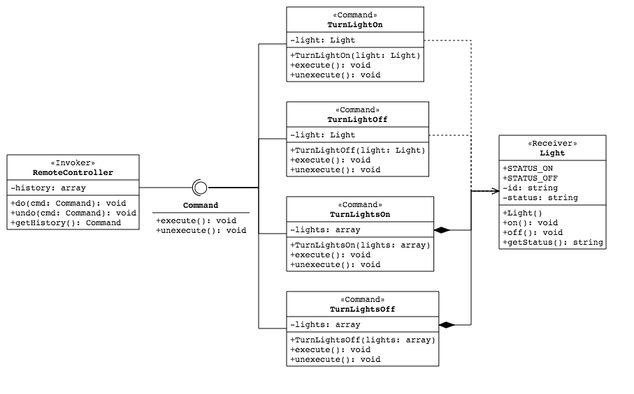
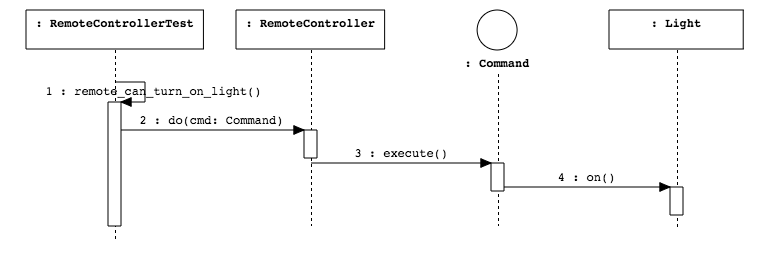
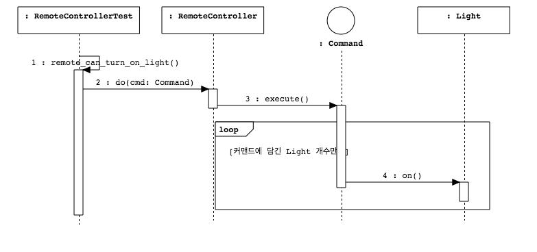

## Command

[기존 구현](../Command/README.md) 대비 커맨드 패턴에 대한 이해도가 높아져서 다시 연습해본 프로젝트입니다.

### 1. 설치 및 실행

```bash
~/pattern $ composer install
~/pattern $ vendor/bin/phpunit Behavioral/Command2
```



### 2. UML

`execute()`, `unexecute()` 모두 파라미터가 없고, 리턴 타입이 `void`입니다. 커맨드는 자신이 가진 책임을 수행하기 위해 필요한 데이터와 행동을 스스로 캡슐화하고 있기 때문입니다. 커맨드는 `Light`라는 컨텍스트를 가지고 있으며, `execute()` 에서 컨텍스트의 어떤 함수를 호출해야 할 지도 이미 알고 있습니다(=~Self-contained & Self-handling).

반면 `RemoteController`는 `do()`와 `undo()`의 파라미터로 받은 커맨드가 `Command` 타입이며, `execute()`와 `unexecute()`를 호출할 수 있다는 사실외에 이 커맨드가 어떤 일을 하는 지 전혀 모릅니다. 대신 `RemoteController`는 커맨드 수행 이력을 관리하는 부가적인 책임을 가지고 있습니다.







UML에 표현되지 않았지만, `RemoteController`가 관리하는 커맨드 수행 이력을 이용해서 `Light`의 상태를 직전 상태로 쉽게 돌려 놓을 수 있습니다. Undo(Ctrl+z)라고 생각하면 쉽습니다. 테스트에 관련 내용을 담고 있습니다.
