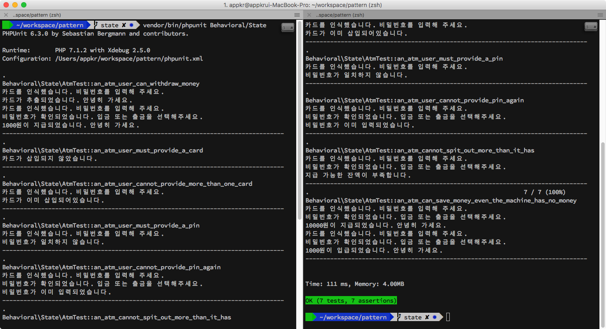
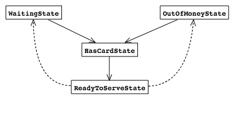
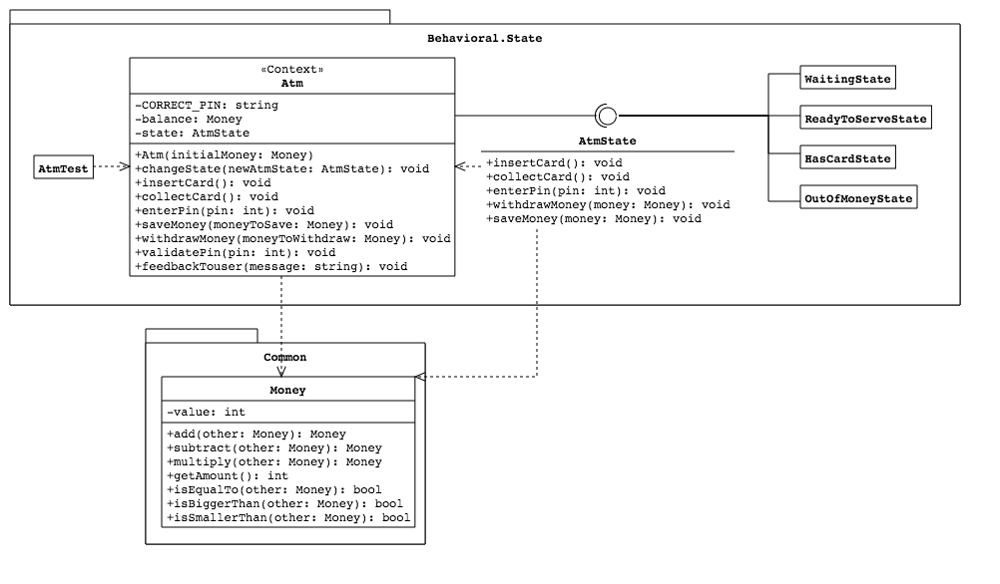

## State

상태 패턴은 전략 패턴의 응용이라 볼 수 있습니다. 상태 패턴은 

1. 상태에 따른 동작을 사용하는 컨텍스트(이 예제에서는 `Atm` 클래스)
2. 컨텍스트의 상태를 표현하는 인터페이스(`AtmState`) 및 구현체

로 구성됩니다.

### 1. 설치 및 실행

```bash
~/pattern $ composer install
~/pattern $ vendor/bin/phpunit Behavioral/State
```



### 2. 시나리오

이 프로젝트는 현금 인출기의 현재 상태(state)에 따라, 현금 인출기가 사용자의 요청에 반응하여 다르게 작동하는 예제입니다. 

#### 2.1. 상태 식별

현금 인출기의 상태는 `Waiting`과 `OutOfMoney`, 그리고 `HasCard`와 `ReadyToServe`로 구분했습니다. `ReadyToServe` 상태에 도달하면 입금 또는 출금이 가능한데, `Atm`의 현재 상태에 따라 `Waiting` 또는 `OutOfMoney` 상태로 전이될 수 있습니다.



상태(state)와 상태(status)를 국어로 구분하기는 굉장히 힘든데요. 앞서 말한 상태는 state입니다. state가 동영상이 재생되고 있는 특정 프레임이라면, status는 주요 장면 또는 기승전결 같은 느낌입니다. 국어로는 전부 상태이지만, 영어에서는 state와 status를 구분한다고 하네요. 차이는 다음 내용을 참고해주세요.

- status: 상태의 경과를 특정 단어로 표현할 때. e.g. order status
- state: 전반적인 상태를 표현할 때. e.g. application state

참고: http://englishsamsam.tistory.com/164

#### 2.2. 동작 식별

현금 인출기에 대해 사용자가 취할 수 있는 동작, 바꾸어 말하면 현금 인출기의 함수죠. `insertCard()`, `collectCard()`, `enterPin()`, `saveMoney()`, `withdrawMoney()`로 식별했습니다. 

특정 상태에서 같은 요청에 대한 반응이 달라집니다. 사용자의 요청, 즉 동작에 의해 상태가 전이됩니다. 상태와 동작은 서로 연결되어 있습니다.

### 3. UML


