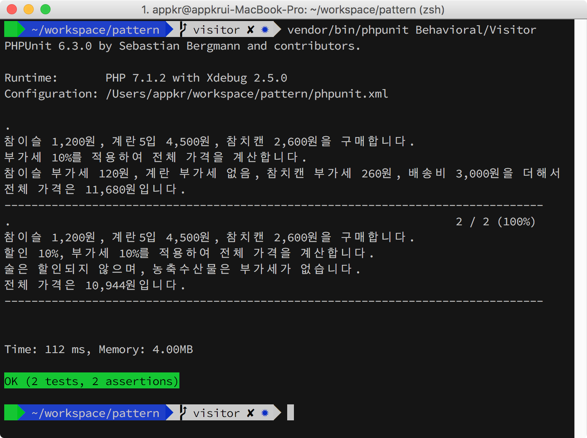
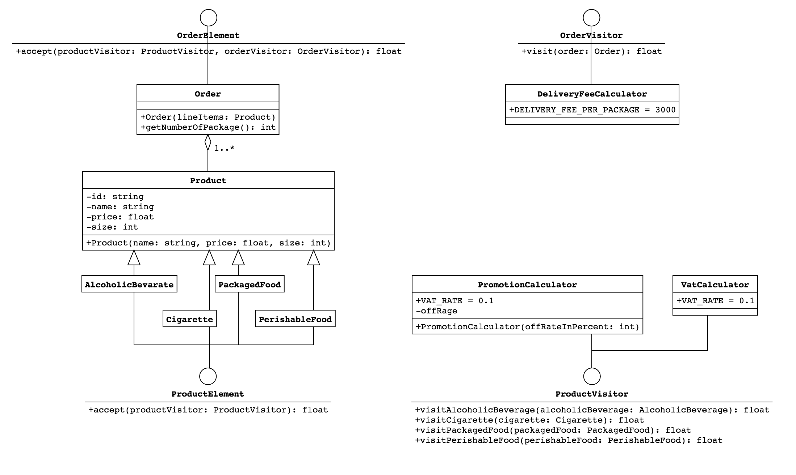
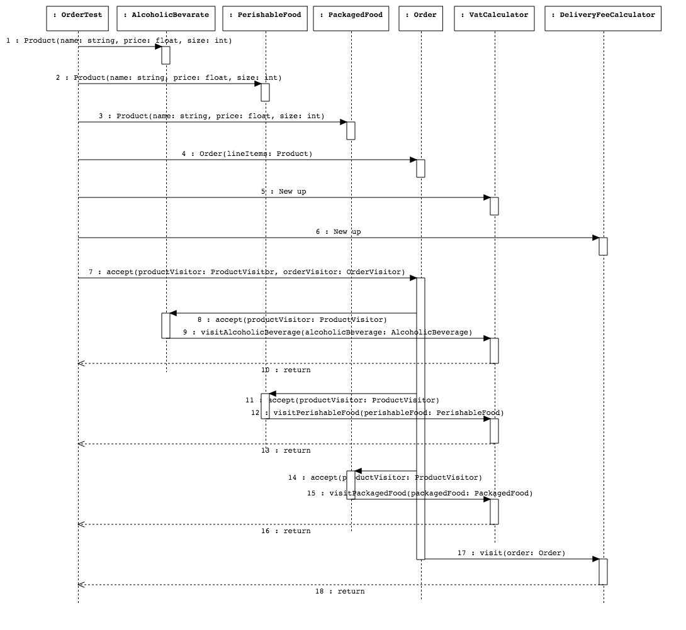

## Visitor

### 1. 설치 및 실행

```bash
~/pattern $ composer install
~/pattern $ vendor/bin/phpunit Behavioral/Visitor
```



### 2. 시나리오

### 3. UML

#### 3.1. 클래스 다이어그램

작업 중에 다이어그램 유실 ㅜㅜ. 망할 StarUML. 완전 의욕 떨어짐. 공들여 그린 SD는 완전히 사라짐.



#### 3.2. 시퀀스 다이어그램


