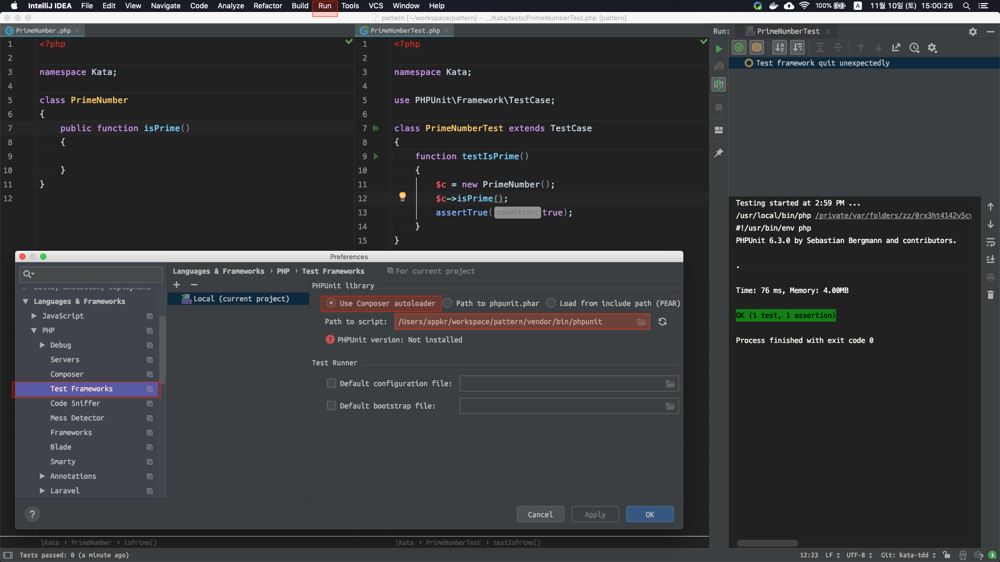

## TDD Kata

TDD 연습 프로젝트 입니다.

- [1. Prime Number](#1-prime-number)
- [2. Prime Factor](#2-prime-factor)

### 1. Prime Number

- 소수(素數, Prime Number): 1과 자기 자신으로만 나눌 수 있는 1을 제외한 자연수

> *에라토스테네스의 체 [Youtube](https://www.youtube.com/watch?v=fdTzyaDPhdo?t=15m41s)[나무위키](https://namu.wiki/w/소인수분해)*
>
> 3개 이상의 소수로 구성된 합성수는 그 수의 제곱근보다 작거나 같은 약수를 갖는다.
> 
> n을 합성수라 하자. 그러면 n = a * b, 1 < a,b < n이다. 만약 a, b가 둘 다 sqrt(n)보다 크다면, (n = sqrt(n) * sqrt(n)) < (a * b = n)이 되어 모순이다. 따라서 a, b중 적어도 하나는 sqrt(n)보다 작다.
> 
> e.g. 187을 합성수라 하자. 그러면 187 = 11 * 17, 1 < 11, 17 < 187이다. 만약 11, 17 둘 다 sqrt(187) = 13.67 보다 크다면, (187 = sqrt(187) * sqrt(187)) < (11 * 17 = 187)이 되어 모순이다. 따라서, 11, 17중 적어도 하나는 sqrt(187) = 13.67보다 작다.

- [합성수(合成數, Composite Number)](https://namu.wiki/w/합성수): 여러 소수(素數)들이 곱셈으로 합쳐져서 이루어진 수를 말한다. 즉 임의의 자연수 n에 대해 1과 자기 자신을 제외한 다른 약수가 존재할 때, 이 수를 합성수라고 한다.

#### 1.1. 목표

- 매개변수로 주어진 자연수 `n`이 소수인지를 판별하여 `bool`을 응답하는 함수를 개발한다.
- "테스트 코드가 구체화될수록 프로덕션 코드는 더 일반화된다"라는 가치를 체감한다.

#### 1.2. 셋업

[[commit](https://github.com/appkr/pattern/commit/39f7dbba65bce31eae0a5584b71d6be598a6fc68)]

최초 한번 셋팅 후에는 단축키(저의 IDE에서는 <kbd>ctrl</kbd>+<kbd>r</kbd>)로 테스트를 실행할 수 있습니다.



#### 1.3. 첫 실패

[[commit](https://github.com/appkr/pattern/commit/bd79f24ce16662ce6668165dc579f1a3265f21d1)]

아래 코드에서 4는 소수가 아닌데, 소수라고 `true`를 잘못 반환합니다.

```php
class PrimeNumber
{
    public function isPrime($n)
    {
        return true;
    }
}
```

```php
class PrimeNumberTest extends TestCase
    function testIsPrime()
    {
        $c = new PrimeNumber();

        assertTrue($c->isPrime(2));
        assertTrue($c->isPrime(3));
        assertFalse($c->isPrime(4));
    }
}
```

#### 1.4. 최소의 노력으로 그린 만들기

[[commit](https://github.com/appkr/pattern/commit/a8732c829b534cab266e2c71c47c5e29e60e8986)]

2와 3은 소수으므로 `true`를 바로 반환하고, 4는 2*2로 소인수 분해할 수 있으므로, 2로 나누어 나머지가 0이면 `false`를 반환하도록 수정했습니다.

```php
class PrimeNumber
{
    public function isPrime($n)
    {
        if ($n == 2) {
            return true;
        }
        if ($n == 3) {
            return true;
        }
        if ($n % 2 == 0) {
            return false;
        }
    
        return true;
    }
}
```

#### 1.5. 두번째 실패

[[commit](https://github.com/appkr/pattern/commit/d924a2f43a27f018c468826d7a9c7fb96e4b2120)]

9는 소수가 아닌데, 우리의 알고리즘은 소수라고 판단합니다. 왜냐하면, 아래에서 어떤 조건문도 타지 않기 때문입니다.

```php
class PrimeNumber
{
    public function isPrime(9)
    {
        if (9 == 2) { // false
            return true;
        }
        if (9 == 3) { // false
            return true;
        }
        if (9 % 2 == 0) { // false
            return false;
        }
    
        return true;
    }
}
``` 

역시 최소의 노력으로 그린을 만듭니다. 9는 3*3으로 소인수 분해할 수 있으므로, 3로 나누어 나머지가 0이면 `false`를 반환하도록 수정했습니다. 이제 9 % 3 == 0 평가식이 `true`가 되어, 9는 소수가 아니라고 정상적으로 판단합니다.

```php
class PrimeNumber
{
    public function isPrime($n)
    {
        // ...
        if ($n % 3 == 0) {
            return false;
        }
    
        return true;
    }
}
```

#### 1.6. 알고리즘 일반화 리팩토링

[[commit](https://github.com/appkr/pattern/commit/0c9c1460a36cb4185099ed6019779483c6918fe0)]

소수의 정의에 따르면, 자연수 n을 2부터 나누기 시작해서 n-1까지 나누어 봤을 때, 나머지가 0으로 떨어지지 않으면 소수라고 할 수 있습니다. 그대로 구현해봤습니다.

```diff
 class PrimeNumber
     public function isPrime($n)
     {
         // ...
-        if ($n % 2 == 0) {
-            return false;
-        }
-        if ($n % 3 == 0) {
-            return false;
-        }
+        for ($i = 2; $i < $n; $i++) {
+            if ($n % $i == 0) {
+                return false;
+            }
+        }

         return true;
 }
```

함수에 10을 넣어 볼까요? $i = 2일 때 10 % 2 == 0 평가식이 `true`가 되어 소수가 아니라고 판단합니다. 

반면, 함수에 11을 넣어 볼까요? 2부터 10까지 총 9번의 루프를 돌았지만, 11을 나눌수 없었습니다. 즉 11은 소수입니다.

```php
class PrimeNumber
    public function isPrime(11)
    {
        if (11 == 2) { // false
            return true;
        }
        if (11 == 3) { // false
            return true;
        }        
        for ($i = 2; $i < 11; $i++) {
            if (11 % $i == 0) { // ($i=2, false), ($i=3, false), ..., ($i=10, false)
                return false;
            }
        }

        return true;
}
```

#### 1.7. 더 많은 수

[[commit](https://github.com/appkr/pattern/commit/b7ebe6729bfefbe9040087e98c06f657e17417d7)]

1,000까지 소수 목록을 찾아서 상수로 선언하고, 알고리즘이 잘 작동하는지 확인해봤습니다.

```php
class PrimeNumberTest extends TestCase
{
    const PRIMES = [11, 13, ..., 991, 997];
    
    function testIsPrime()
    {
        $c = new PrimeNumber();
        // ...
        assertFalse($c->isPrime(10));

        foreach (self::PRIMES as $prime) {
            assertTrue($c->isPrime($prime));
        }

        $nonPrimes = array_diff(range(10, 1000), self::PRIMES);

        foreach ($nonPrimes as $nonPrime) {
            assertFalse($c->isPrime($nonPrime));
        }
    }
}
```

#### 1.8. 성능 개선 리팩토링

[[commit](https://github.com/appkr/pattern/commit/79ce4eef18aca0d3578baa3f7e8a0a238b223a88)]

1.6의 알고리즘에서는 자연수 n이 소수인지 판단하기 위해서는 n-2번의 루프가 필요했습니다. 가령 검사하려는 수가 11이라면, 2부터 10까지 전부 나눠봐야하므로 9번의 루프가 발생했습니다. 즉, 시간복잡도는 `O(n-2)` 입니다.

웹에서 `에라토스테네스의 체`라는 알고리즘을 배우고 적용했습니다. 이 알고리즘 적용으로 시간복잡도는 `O((n-2)^1/2)`로 최적화되었습니다. 가령 위에서 살펴본 11의 제곱근은 3.32 이므로, ($i = 2, 11 % 2 != 0), ($i = 3, 11 % 3 != 0) 총 두번만 루프를 돌게됩니다.

```diff
 class PrimeNumber
-        for ($i = 2; $i < $n; $i++) {
+        for ($i = 2; $i <= sqrt($n); $i++) {
```

### 2. Prime Factor

#### 2.1. 목표

- 매개변수로 주어진 자연수 `n`을 소수로 약분하여, `n`을 구성하는 소수의 집합을 반환하는 함수를 개발한다.

#### 2.2. 첫 실패

[[commit](https://github.com/appkr/pattern/commit/8f4b648b0a0ea5cb46e55a5de4430a790aa0e66e)]

4를 소인수분해한 결과로 `[2, 2]`를 기대했지만, `[4]`가 반환되었습니다.

```php
class PrimeNumber
    public function factorize($n)
    {
        return [$n];
    }
}
```

```php
class PrimeNumberTest extends TestCase
    function testFactorize()
    {
        $c = new PrimeNumber();

        assertEquals([2], $c->factorize(2));
        assertEquals([3], $c->factorize(3));
        assertEquals([2, 2], $c->factorize(4));
    }
}
```

#### 2.3. 최소의 노력으로 그린 만들기

[[commit](https://github.com/appkr/pattern/commit/75dcd65da807ffd8490c2d47e0c43e0d6c1c46e6)]

아래 코드에서,

- $n = 4일때, `4 % 2 == 0` 평가식이 참으므로, `$primes = [2]`, `4 / 2 = 2 = $n`가 됩니다.
- 이제 $n = 2이므로, `2 % 2 == 0` 평가식이 참이므로, `$primes = [2, 2]`, `2 / 2 = 1 = $n`이 됩니다.
- 이제 $n =1이므로, 루프를 빠져 나갑니다. 또, `1 > 1`은 거짓이므로 조건문도 타지 않고, `[2, 2]`를 반환합니다.

```diff
class PrimeNumber

     public function factorize($n)
     {
-        return [$n];
+        $primes = [];
+        while ($n % 2 == 0) {
+            $primes[] = 2;
+            $n /= 2;
+        }
+        if ($n > 1) {
+            $primes[] = $n;
+        }
+
+        return $primes;
     }
 }
```

#### 2.4. 두번째 실패

[[commit](https://github.com/appkr/pattern/commit/7c208535e0cce01fdaf1bddfe1af91cc06e9e6e4), [commit](https://github.com/appkr/pattern/commit/c1150d3c9dbd7a59ab0e6299f617e40540e37919)]

9를 소인수분해한 결과로 `[3, 3]`를 기대했지만, `[9]`가 반환되었습니다.

- $n = 9일 때, `9 % 2 == 0` 평가식이 거짓으므로, while 루프를 건너뜁니다.
- `9 > 1` 평가식이 참이므로, `$primes = [9]`가 되어 반환됩니다.

2로 나누어 떨어지지 않을 때는, 3, 4, ... 처럼 1씩 증가시키면서 나눌 수 있도록 중첩 루프를 씌웠습니다.

```diff
class PrimeNumber
     public function factorize($n)
     {
         $primes = [];
-        while ($n % 2 == 0) {
-            $primes[] = 2;
-            $n /= 2;
-        }
-        if ($n > 1) {
-            $primes[] = $n;
+        $divider = 2;
+        while ($n > 1) {
+            while ($n % $divider == 0) {
+                $primes[] = $divider;
+                $n /= $divider;
+            }
+            $divider++;
         }

         return $primes;
     }
 }
```

- $n = 9일때, `9 > 1` 평가식이 참이므로 outer 루프를 시작합니다.
- inner 루프의 평가식 `9 % 2 == 0`은 거짓으므로 inner 루프를 건너뜁니다.
- `$divider++` 증가식에 의해 이제 `$divider = 3`이 되었고, outer 루프로 돌아갑니다.
- `9 > 1` 평가식은 여전히 참이므로, outer 루프를 계속 합니다.
- 이번에는 inner 루프의 평가식 `9 % 3 == 0`으로 참입니다. 이제 `$primes = [3]`, `9 / 3 = 3 = $n`이 됩니다.
- inner 루프로 다시 돌아가서 `3 % 3 == 0`은 참이므로, `$primes = [3, 3]`, `3 / 3 = 1 = $n`이 됩니다.
- `1 % 3 == 0`은 거짓이므로 inner 루프를 마치고, `1 > 1` 또한 거짓이므로 outer 루프도 마칩니다.

> $n = 11이면, `$divider`가 2부터 11까지 증가할 동안 outer 루프를 10번 타고, `$divider`가 11일 때 inner 루프 한번을 탑니다. 
>
> $n = 187 = (11 * 17) 이면 어떻게 될까요? 2부터 11까지 outer 10번 + inner 1번, 12부터 17까지 outer 6번 + inner 1번, 총 18번의 루프를 타게 됩니다. [시간복잡도](https://ko.wikipedia.org/wiki/시간_복잡도) 식을 어떻게 써야 할 지 모르겠네요.  

#### 2.5. 더 많은 테스트 케이스

[[commit](https://github.com/appkr/pattern/commit/1e4f7c6c0d1797d4a7da0c3df8536ca142575790)]

이 프로젝트의 목적인 TDD와는 무관하지만, 여기서 재밌는 사실을 발견하는데요. 소인수의 개수가 조금만 많아져도 소인수 분해의 성능이 급격히 떨어지는 것을 체감 할 수 있습니다. 소수를 곱해서 자연수를 만드는 것은 쉽지만, 자연수를 소인수 분해하는 것은 어렵다는 특징을 이용하는 것이 RSA 암호화라고 알려져 있습니다. 

가령, 아래 코드에서 무작위 정렬된 소수 3개를 `array_slice(..);` 함수로 뽑아서 테스트 케이스를 만들고 있는데요. 소수 10개 정도만 뽑아도 컴퓨터가 버거워 할 겁니다.

```diff
 class PrimeNumberTest extends TestCase
 {
         assertEquals([3, 3], $c->factorize(9));
+        assertEquals([2, 5], $c->factorize(10));
+
+        foreach (self::PRIMES as $prime) {
+            assertEquals([$prime], $c->factorize($prime));
+        }
+
+        $primes = array_merge([2,3,5,7], self::PRIMES);
+        foreach (range(1, 10) as $i) {
+            // 소수 목록 셔플링
+            shuffle($primes);
+            // 앞에서부터 3개만 추출. e.g. [7, 2, 3]
+            $set = array_slice($primes, 0, 3);
+            // 정렬. e.g. [2, 3, 7]
+            sort($set);
+            // array_product([2, 3, 7]) = 2 * 3 * 7 = 42
+            assertEquals($set, $c->factorize(array_product($set)));
+        }
     }
 }
```

#### 2.6. 리팩토링

[[commit](https://github.com/appkr/pattern/commit/c9a7e05d2b5825d83f5c0dda7c05da8f75e20207)]

초기식과 탈출 조건, 증감 조건을 한 줄에 쓸 수 있는 for 루프로 대체했습니다. 최종 코드는 아래와 같습니다.

```php
class PrimeNumber
{
    public function factorize($n)
    {
        $primes = [];
        for ($divider = 2; $n > 1; $divider++) {
            for (; $n % $divider == 0; $n /= $divider) {
                $primes[] = $divider;
            }
        }

        return $primes;
    }
}
```

> 2절의 소인수분해 알고리즘은 라라캐스트의 [Prime Factors](https://laracasts.com/series/code-katas-in-php/episodes/1), 백명석님의 [클린 코더스 강의 9. TDD4 - primefactors and wordwrap](https://www.youtube.com/watch?v=X4JtF2BfA0U) 영상을 참고했습니다.
