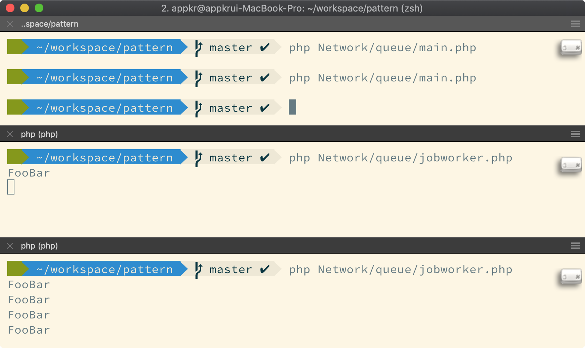

## Queue

- First come first served 를 보장하는 데이터 구조를 의미함
- 프로세스, (이기종) 머신간에 메시지를 주고 받기 위한 목적으로 사용 
- 웹 아키텍처에서는 메시지 교환 또는 비동기 처리를 위해 사용함 

PHP는 멀티 프로세스로 작동합니다. 다수의 웹 요청(=워크 로드)을 동시에 처리하기 위해 아파치 mod_php, fpm 과 같은 프로세스 매니저가 다수의 PHP 프로세스를 띄웁니다.  

쓰레드와 달리 프로세스들은 서로 격리된 메모리 공간에서 작동합니다. 그렇다면 프로세스간에 공유해야할 데이터가 있다면 어떻게 할까요? 예, 시공간을 초월한 데이터 공유를 위해 공유된 데이터베이스(RDS), 공유된 캐시, 공유된 파일 시스템(S3) 등을 사용하죠.

또 하나의 방법은 큐를 사용하는 겁니다. 서두에 언급했듯이 큐는 데이터 구조이며, 이 데이터 구조에 맞게 프로세스간 데이터를 교환해주는 장치를 큐라고 부르기도 합니다. 파일 큐, 레디스 큐, SQS 등등을 매체로 사용합니다. 

#### Example

- Web/Api 등 UI 프로세스에서 처리하기에는 매우 무겁과 비싼 작업을 작업 지시서(=Job, =~메시지)로 만들어 큐에 넣습니다.
- 무한 루프(또는 주기적)으로 작동하는 워커가 큐에 메시지가 있으면 읽어서 처리합니다.
- 다수의 Web/Api 프로세스가 큐에 메시지를 밀어 넣고, 다수의 워커가 메시지를 처리합니다.
- 그림에서는 상단이 Web/Api 프로세스, 하단의 2개 창이 워커를 흉내내고 있습니다.

#### 점진적 학습
##### 8e9f9a8 큐 이해하기: 멀티프로세스와 워커
큐의 용도 이해하기

##### 8fe7555 큐 이해하기 #2: 이벤트핸들러에서 큐를 이용해 비동기 처리하기
큐와 이벤트는 완전히 다른 개념이지만, 이벤트 핸들러에서 직접 핸들링 하지 않고, 작업 지시서를 잘 만들어서 큐에 넣고, 다른 프로세스에서 작업을 처리할 수도 있을겁니다.

##### d1f86ee 큐 이해하기 #3: Job, JobDispatcher, JobWorker
디스패처란 함수를 호출해주는 모듈을 일컫는데, 이 예제에서는 큐에 Job을 밀어 넣는 일을 합니다. 함수를 호출보다는 "보내다"의 의미로 이해하는게 좋겠습니다.
