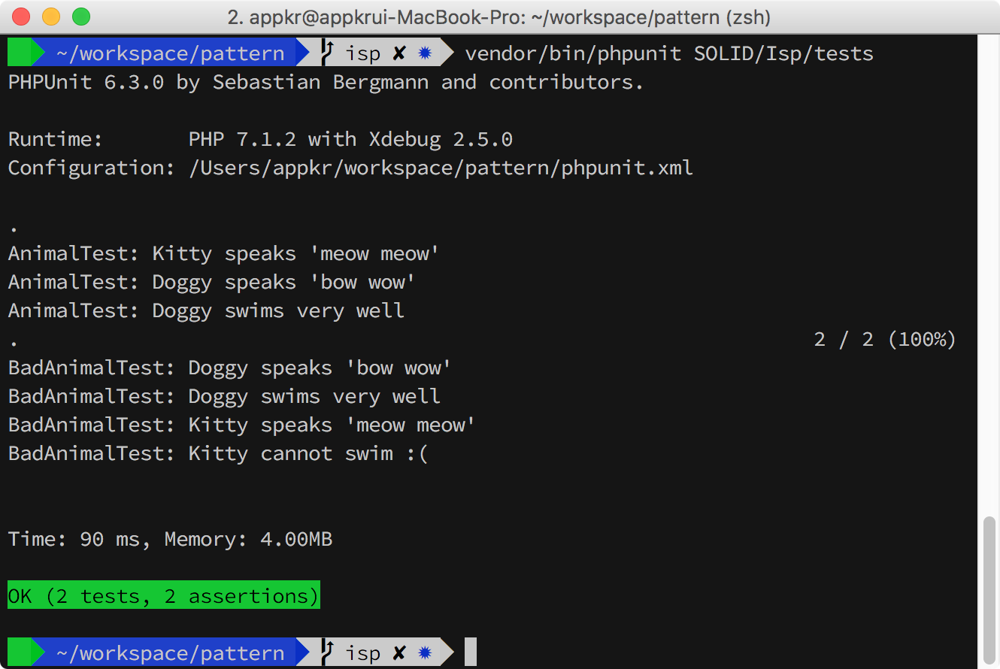
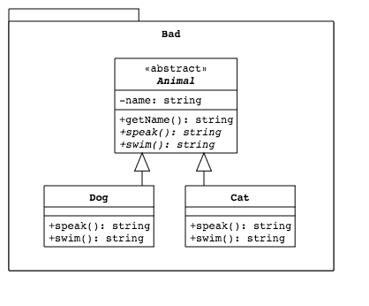
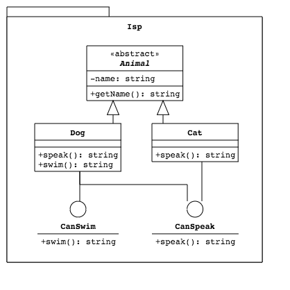

## SOLID - Interface Segregation Principle

인터페이스 분리 원칙은 하위 타입에서 구현할 필요가 없는 동작을 상위 타입에서 구현하도록 강제하지 말아야 한다는 원칙입니다. "인터페이스"라는 단어는 PHP, Java, C++/C#에 있는 `interface`라는 언어 구조체를 의미하지는 않습니다. 그럼에도 불구하고, `interface`가 있는 언어에서 인터페이스가 될 함수를 잘 분류하지 않아서 흔히 발생할 수 있는 문제이긴 합니다.

### 1. 설치 및 실행

```bash
~/pattern $ composer install
~/pattern $ vendor/bin/phpunit SOLID\Isp
```



### 2. Bad Scenario



예제에서는 `abstract Class Animal`은 `abstract function` 키워드로, 이 클래스를 상속받는 하위 클래스는 무조건 `speak()`와 `swim()` 클래스를 구현하도록 강제하고 있습니다. `abstract`가 아니라, `interface`를 사용해도 마찬가지일겁니다. 참고로 PHP는 컴파일 언어가 아니므로 `abstract` 선언된 함수를 구현하지 않으면 런타임에 오류가 발생합니다.

`Animal` 상위 타입을 상속 받은 `Dog` 하위 타입은 `speak()`와 `swim()` 능력(=Capability or Behavior)을 가지는 것이 어색하지 않죠? 상식적으로 개는 멍멍 짓고, 수영도 잘 하잖아요~

반면, `Animal` 상위 타입을 상속 받은 `Cat` 하위 타입은 `speak()` 능력을 가지는 것은 당연하지만, `swim()` 능력을 가지는 것은 어색합니다. 상위 타입에서 구현을 강제했기 때문에 어쩔 수 없이 `swim()`을 구현하고 있지만, 함수 본문에서 `Cat` 타입은 수영을 할 수 없다고 예외를 던지는 식으로 구현하고 있습니다. 설계가 잘못된 것입니다.

### 2. ISP Conformance Scenario



PHP는 다중 상속을 지원하지 않으므로, 이 시나리오에서는 `interface`를 사용했습니다. 예제에서 사용한 `abstract Class Animal`은 `Dog`과 `Cat` 구현체에서 중복을 방지하기 위한 [`Template Method Pattern`](https://en.wikipedia.org/wiki/Template_method_pattern)이며, 인터페이스 분리 원칙과는 무관합니다.

기존 시나리오와 달리 인터페이스를 잘게 쪼개서 `Dog` 타입은 `CanSpeak`와 `CanSwim` 인터페이스를 모두 구현하고 있는 반면, `Cat` 타입은 `CanSpeak` 인터페이스만 구현하고 있습니다. 따라서, `Cat` 클래스는 이제 더 이상 `swim()` 함수를 구현할 필요가 없습니다. 

여기서 조금 더 발전하면 Bahavior의 하위 타입을 여러 개 두고, 런타임에 선택적으로 주입하는 `Stragety` 패턴으로 진화할 수 있는데, 기회가 되면 또 한번 예제를 만들어 보겠습니다. 
