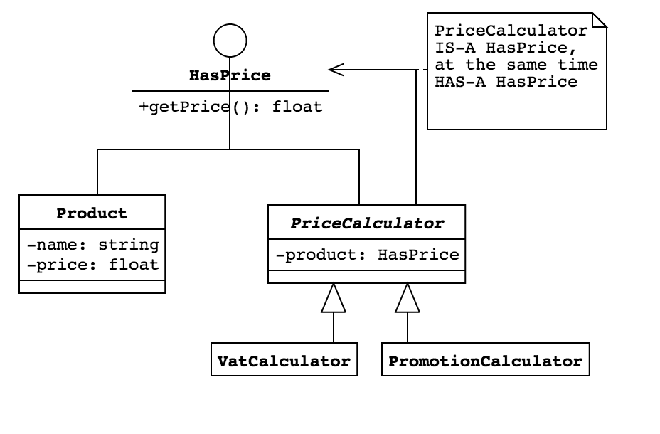
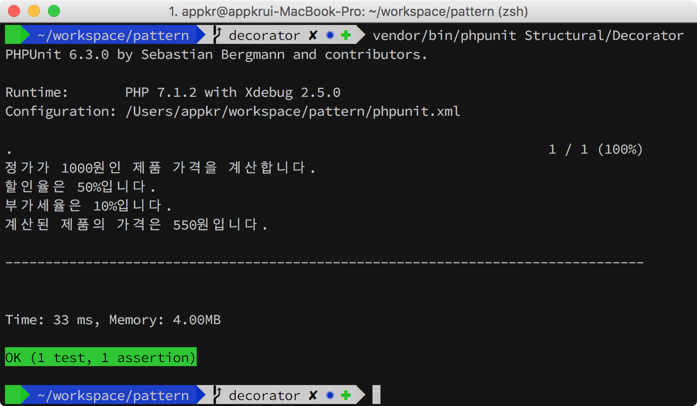

## Decorator

제품 가격을 계산하는 예제입니다. 



`PriceCalculator`의 구현 클래스들을 런타임에 동적으로 조합해서 `Product::getPrice()` 함수가 원래 가지고 있던 동작을 변경(추가)합니다. 원래 가지고 있던 동작인 1000원을 반환하는 동작이라면, `PromotionCalculator::getPrice()`를 거치면서 500원이 되고, 다시 `VatCalculator::getPrice()`를 거치면서 550원으로 바뀝니다. `Product::getPrice()` 함수의 변경없이, 다른 클래스를 이용해서 책임을 추가(확장)한다는 점이 중요합니다.

[위키피디아](https://en.wikipedia.org/wiki/Decorator_pattern#PHP) 설명에 따르면 `HasPrice`는 Component, `Product`는 Concrete Component, `PriceCalculator`는 Decorator, `PromotionCalculator`는 Concrete Decorator 입니다. **Decorator는 Component 타입이기도 하면서, Component 타입의 다른 객체를 자신의 애트리뷰트로 가지고 있다는 점을 주목해야 합니다(Is-a && Has-a).** 

예제에서 `PriceCalculator`는 `HasPrice` 타입이면서, 생성자에서 `HasPrice` 타입의 객체를 받고, 자신의 `getPrice()` 함수에서 멤버 변수에 할당된 `HasData` 타입의 객체의 `getPrice()` 함수를 호출함으로써 기능을 확장하거나 동작을 변경합니다.

Decorating 하는 객체의 `getPrice()`가 Decorating 받는 객체의 `getPrice()` 함수를 호출하므로, 마치 양파처럼 바깥쪽의 객체가 먼저 사용됩니다. 반대로 반환값은 양파의 가장 안쪽에서 바깥쪽으로 전달됩니다. 

예제에서는 아래와 같이 사용하고 있습니다.

```php
$product = new Product(); // 1000원
$promotionCalculator = new PromotionCalculator($product); // 반값으로 할인
$vatCalculator = new VatCalculator($promotionCalculator); // 부가세 10% 부과
$price = $vatCalculator->getPrice();
```

- `VatCalculator::getPrice()` 함수가 `PromotionCalculator::getPrice()` 함수를 호출합니다.
- `PromotionCalculator::getPrice()` 함수가 `$product::getPrice()` 함수를 호출합니다.
- `$product::getPrice()` 함수가 1000을 반환합니다.
- `PromotionCalculator::getPrice()` 함수가 `$product::getPrice()` 호출하여 받은 1000을 500으로 바꿔서 반환합니다.
- `VatCalculator::getPrice()` 함수가 받은 500을 550으로 바꿔서 반환합니다. 

### 1. 설치 및 실행

```bash
~/pattern $ composer install
~/pattern $ vendor/bin/phpunit Structural/Decorator
```


