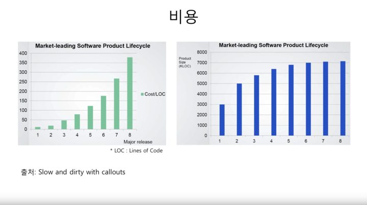
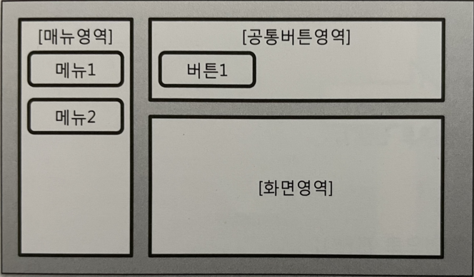
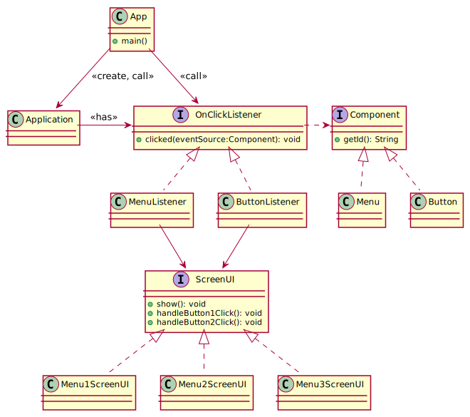

# Ch01 들어가기

- 고객: 처음에는 빠르게 요구사항을 반영해주었는데, 시간이 지날수록 간단한 요구사항 조차도 제때 개발이 안되고 있어요.
- 개발자: 겉보기엔 간단하지만, 변경해야 할 곳이 너무 많습니다. 게다가 어딜 변경해야 할 지도 다 알 수 없어서 변경 이후에 어떤 기능에 문제가 생길지 모르겠어요.

우리가 개발하는 소프트웨어는 [E-type 시스템](https://itwiki.kr/w/%EB%A6%AC%EB%A8%BC_%EC%86%8C%ED%94%84%ED%8A%B8%EC%9B%A8%EC%96%B4_%EB%B3%80%ED%99%94_%EC%9B%90%EB%A6%AC)이다. 1장에서는 설계에 미숙한 코드가 어떻게 사업과 개발자의 발목을 잡는지, 그리고 객체 지향 원칙을 이용해서 어떻게 올바른 방향으로 진화시킬 수 있는지를 살펴본다.

## 1 지저분해지는 코드

[그림 1.1] 최초 요구 기능과 관련된 화면 구성

[코드 참조](https://github.com/meshkorea/study-oop-pattern/commits/juwon.kim-ch01)

> 만약 메뉴가 5개 버튼이 5개로 늘어난다면 이 코드는 어떻게 될까? if-else 블록이 점점 커지면 한 개의 메서드가 수 백줄 이상으로 빠르게 증가하게 된다. 이렇게 증가한 조건문은 코드를 복잡하게 만들며, 개발자가 코드를 추가하거나 수정할 위치를 찾는데 점점 오랜 시간이 걸리게 된다. 따라서, 간단한 **요구사항 조차도 제 때 개발이 안되는 상황**이 발생하는 것이다.

## 2 수정하기 좋은 구조를 가진 코드

- 객체 지향에서는 [**추상화**와 **다형성**](https://gist.github.com/appkr/a13a2172c943dbfd8e8a45fad4ee8045#04-%EB%8B%A4%ED%98%95%EC%84%B1%EA%B3%BC-%EC%B6%94%EC%83%81%ED%99%94)을 이용해서 변화되는 부분을 관리한다
- 메뉴1을 선택했을 때와 메뉴2를 선택했을 때 비슷하게 동작하는 부분이 있다: "화면을 보여주고, 버튼 1을 클릭하면 화면에 반영한다"
- 메뉴를 `ScreenUI` 타입으로 **추상화**
- 메뉴1과 메뉴2를 위한 `ScreenUI` 구현 (**다형성**)
- 메뉴와 버튼 클릭을 처리하는 코드 분리

[코드 참조](https://github.com/meshkorea/study-oop-pattern/commits/juwon.kim-ch01)

> 예를 들어, 메뉴 관련 처리 코드는 메뉴가 추가되거나 삭제될 때 변경되고, 버튼 처리 코드는 버튼이 추가되거나 삭제될 때 변경된다. 물론, 메뉴와 버튼이 동시에 바뀌는 경우가 있긴 하지만 그보다는 **서로 다른 시점에 다른 이유로 변경**될 가능성이 높을 것 같다. 이렇게 서로 다른 이유로 변경되는 코드가 한 메서드에 섞여 있으면 향후에 (코드 가독성이 떨어져서) 유지보수를 하기 어려워질 수 있다.

## 3 소프트웨어의 가치

> 변화 가능한 유연한 구조를 만들어 주는 핵심 기법 중의 하나가 바로 객체 지향이다
