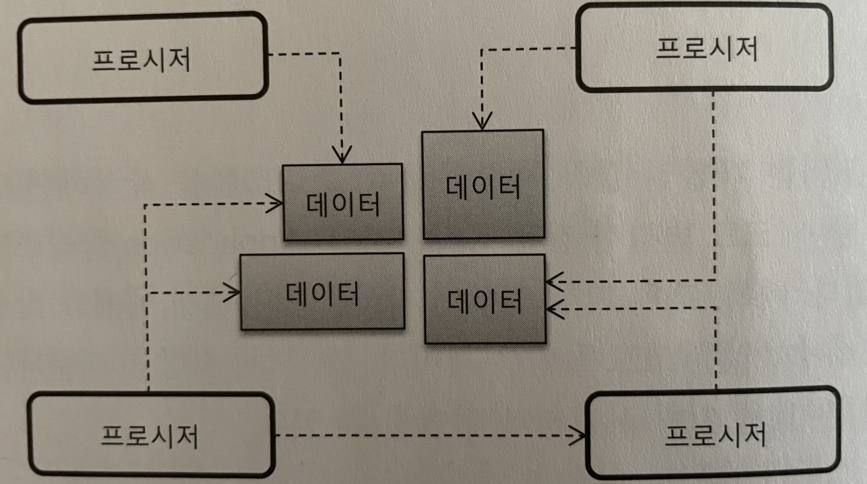
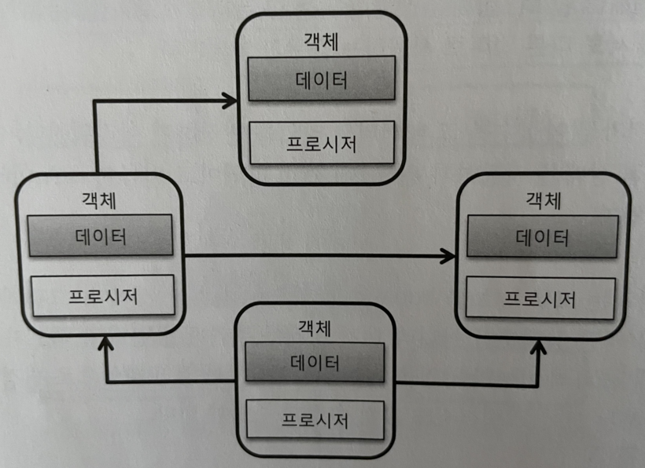
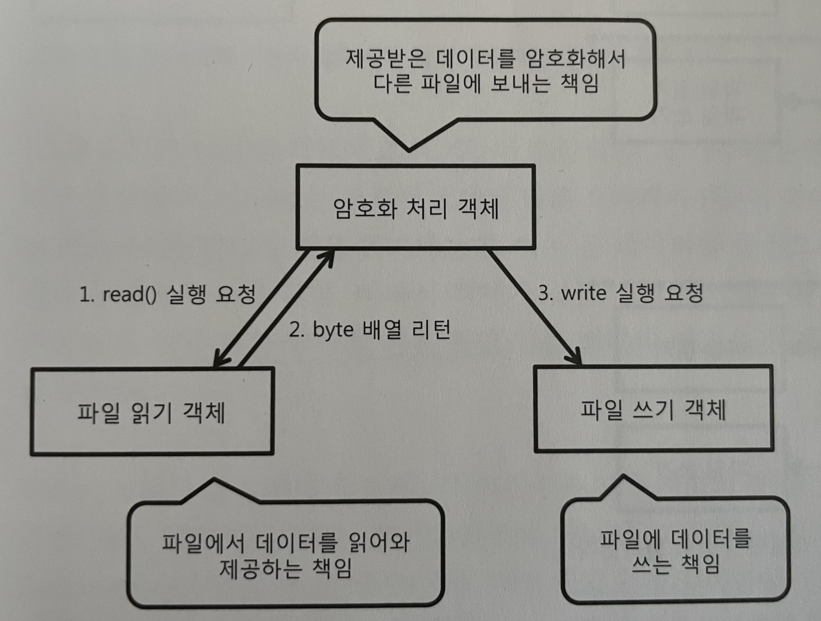
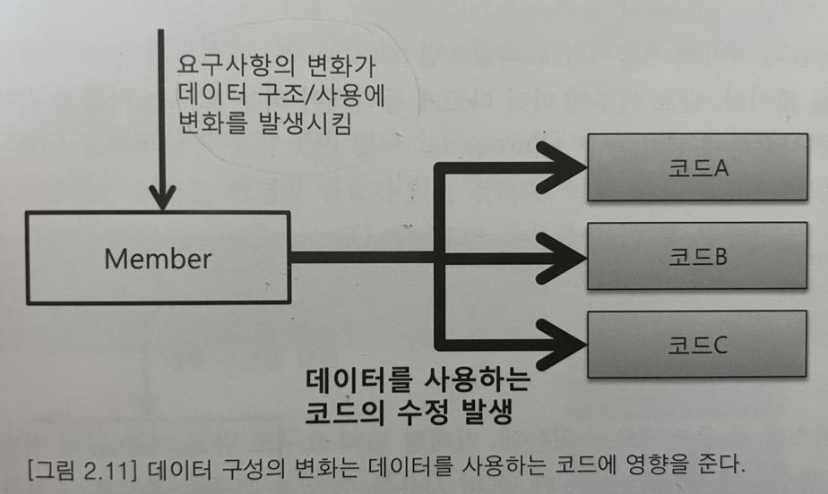
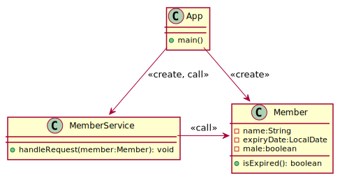
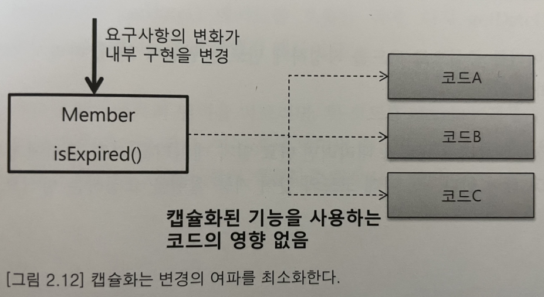
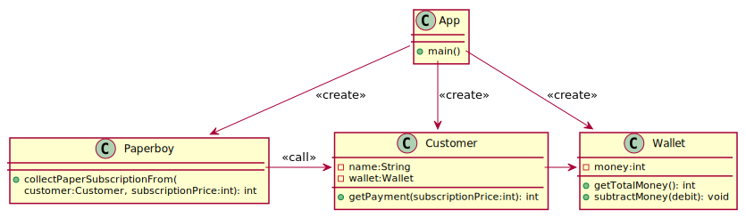

# Ch02 객체 지향

## 1 절차지향과 객체지향

> 소프트웨어를 구현한다는 것은 결국 최종적으로는 소프트웨어를 구성하는 **데이터**와 **데이터를 조작하는 기능**을 작성하는 것이다

- 절차지향: 데이터를 조작하는 코드를 분리해서 함수나 프로시저로 만들고, 각 프로시저들이 데이터를 조작하는 방식
    - 데이터 타입이나 의미를 변경해야할 때, 함께 수정해야 하는 프로시저가 증가한다 (e.g. `boolean isOn`)
    - 같은 데이터를 프로시저들이 서로 다른 의미로 사용하는 경우가 발생한다 (e.g. 계약 만료일이 null이면 오류로 처리하는 프로시저 vs null이면 만료하지 않음으로 처리하는 프로시저)



- 객체지향: 데이터 및 데이터와 관련된 프로시저를 객체라고 하는 단위로 묶는다. 객체는 프로시저를 실행하는데 필요한 만큼의 데이터를 가지며, 객체들이 모여 프로그램을 구성한다
    - 객체의 데이터를 변경하더라도 해당 객체로만 변화가 집중되고 다른 객체에는 영향을 주지 않기 때문에, 요구사항의 변화가 발생했을 때 절차지향 방식보다 프로그램을 더 쉽게 변경할 수 있는 장점이 있다



## 2 객체

> 객체지향 설계란 객체마다 책임을 할당하고, 각 객체가 주고 받는 메시지를 정의하는 과정

### 2.1 객체의 핵심을 기능을 제공하는 것

- 객체는 데이터와 그 데이터를 조작하는 프로시저(오퍼레이션, 메서드, 함수)로 구성된다.
- 이는 객체의 물리적인 특징일뿐이며 실제로 객체는 제공하는 기능으로 객체의 책임이 정의되며, 내부에 가진 데이터로 정의되지 않는다

### 2.2 인터페이스와 클래스

- 객체가 제공하는 모든 오퍼레이션의 집합을 객체의 인터페이스라 함
- 객체를 사용하기 위한 일종의 명세나 규칙
- 인터페이스의 구성 요소 (시그니처)
    - 기능 식별 이름
    - 파라미터 및 파라미터 타입
    - 기능 실형 결과 값
- 실제 객체의 구현을 정의하는 것은 클래스이다
- 메모리에 생성된 객체를 인스턴스라 부른다

### 2.3 메시지

- 객체지향은 기능(오퍼레이션)을 제공하는 여러 객체들이 모여서 완성된 애플리케이션을 구성한다
- 이때 다른 객체가 가진 오퍼레이션의 실행을 요청하는 것을 "메시지를 보낸다"라고 표현한다

## 3 객체의 책임과 크기



- 객체의 기능 == 객체의 책임
- 객체가 갖는 책임의 크기는 작을 수록 좋다 (c.f. 단일 책임 원칙)
    - 파일을 읽어오는 방법을 변경해야 한다면 "파일읽기" 책임을 가진 객체의 코드만 수정되며, 다른 객체의 코드를 수정해야 할 가능성은 낮아진다.


## 4 의존

- 한 객체가 다른 객체를 사용하는 것
    - 다른 객체의 메서드 호출하는 경우
    - 다른 객체를 필드로 가지는 경우
    - 다른 객체를 메서드 파라미터로 가지는 경우
    - 다른 객체를 메서드 안에서 생성하는 경우
- 즉, 다른 객체의 변경이 한 객체에 영향을 미치게 됨

### 4.1 의존의 양면성

- 내가 변경되면 나에게 의존하는 있는 코드에 영향을 미친다
- 나의 요구가 변경되면 내가 의존하는 있는 타입에 영향을 준다


```java
// 새로운 요구사항: 아이디 또는 암호 불일치시 사유를 로그로 남겨달라
public class AuthenticationHandler {
    public void handleRequest(String id, String passwd) {
        Authenticator auth = new Authenticator();
        if (auth.authenticate(id, passwd)) {
            // 아이디/암호 일치할 때의 처리
        } else {
            // 아이디/암호 일치하지 않을 때의 처리
        }
    }
}
```

```java
public class Authenticator {
    public boolean authenticate(String id, String passwd) {
        Member m = findMemberById(id);
        if (m == null) return false;
        return m.equalPassword(passwd);
    }
}
```

## 5 캡슐화

- 객체가 내부적으로 기능을 어떻게 구현하는지를 감추는 것; 이를 통해 내부의 기능 구현이 변경되더라도 그 기능을 사용하는 코드는 영향을 받지 않도록 한다

### 5.1 절차지향 방식 코드

[코드 참조](https://github.com/meshkorea/study-oop-pattern/commits/juwon.kim-ch01)



### 5.2 캡슐화된 기능 구현





### 5.3 캡슐화의 결과는 내부 구현 변경의 유연성 획득

### 5.4 캡슐화를 위한 두 개의 규칙

- Tell, Don't Ask
- 데미테르의 법칙(Law of Demeter) aka. Principle of least knowledge; `O.m()` 메서드는 아래 열거한 다섯 가지보다 더 많은 내용을 알아서는 안된다
    - `O` 자신
    - `m`의 파라미터
    - `m`에서 생성된 객체
    - `O`가 필드로 가진 객체
    - `O.m()` 스코프에서 접근할 수 있는 전역 변수

#### 5.4.1 Paperboy



## 6 객체지향 설계 과정

- 제공해야 할 기능을 찾고 또는 세분화하고, 그 기능을 알맞은 객체에 할당한다
    - 기능을 구현하는데 필요한 데이터를 객체에 추가한다. 객체에 데이터를 먼저 추가하고 그 데이터를 이용하는 기능을 넣을 수도 있다
    - 기능은 최대한 캡슐화해서 구현한다
- 객체간에 어떻게 메시지를 주고받을 지 결정한다
- 과정1과 과정 2를 개발하는 동안 지속적으로 반복한다
