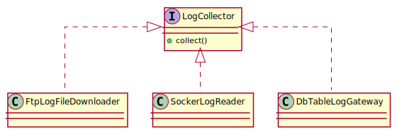
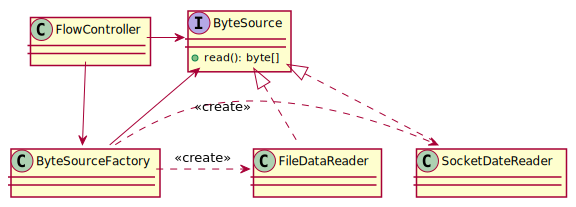

# Ch03 다형성과 추상 타입

## 1 상속 개요
- 상속은 한 타입을 그대로 사용하면서 구현을 추가할 수 있도록 해주는 방법을 제공한다
- 상위(super) 또는 부모(parent)클래스; 하위(sub) 또는 자식(child) 클래스
- 하위 클래스가 상위 클래스의 메서드를 새롭게 구현하는 것을 재정의(overriding)라고 한다

## 2 다형성과 상속
- 다형성(Polymorphism)은 한 객체가 여러 가지 모습을 가질 수 있는 것

### 2.1 인터페이스 상속과 구현 상속
- 인터페이스 상속: 추상 함수만 가진 추상 클래스를 상속 받는 경우
- 구현 상속: 클래스 상속을 통해 이루어짐(상위 클래스에 정의된 기능을 재사용하기 위한 목적)

## 3 추상 타입과 유연함
- 추상화는 데이터나 프로세스 등을 의미가 비슷한 개념이나 표현으로 정의하는 과정

### 3.1 추상 타입과 실제 구현의 연결
- 추상 클래스와 구체 클래스(구상 클래스, Concrete class)
- 다형성에 의해 `collector.collect()` 코드는 실제 `collector` 객체 타입의 `collect()` 메서드를 호출할 것


### 3.2 추상 타입을 이용한 구현 교체의 유연함
- 추상화 과정
    - 어딘거에서 데이터를 읽어 온다는 공통점 발견 -> ByteSource 인터페이스 도출
    - ByteSource 타입의 객체를 생성하는 부분에서 유사점 발견 -> ByteSourceFactory 도출


> 위 그림에서 재사용되는 것은 무엇일까? `FileDataReader`나 `SocketDataReader`를 재사용하기도 하지만, 더 큰 수준에서의 재사용은 전체 흐름을 제어하는 `FlowController`에서 일어난다
>
> 각 구현은 파일이나 소켓이라는 용도로 재사용된다. 한편 `FlowController`는 데이터를 읽고 암호화하고 데이터를 쓰는 핵심 로직을 제공하고 있다. 여기서 `FlowController`는 상대적으로 상위 수준의 로직을 제공하며 `FileDataReader`는 읽기라는 하위 수준의 구현을 제공한다
>
> 암호화 알고리즘이 바뀌거가 데이터를 읽고 쓰는 대상이 바뀌더라도 `FlowController`가 제공하는 상위 수준의 로직은 바뀌지 않고 재사용되므로, **재사용의 중요성으로 봤을 때 하위 수준의 상세 구현보다는 변하지 않는 상위 수준의 로직을 재사용할 수 있도록 설계하는 것이 더 중요하다**

### 3.3 변화되는 부분을 추상화하기
- 추상화되지 않은 코드는 주로 동일 구조를 갖는 if-else 블록으로 드러난다

### 3.4 인터페이스에 대고 프로그래밍하기
- 이 말은 실제 구현을 제공하는 콘크리트 클래스를 사용해서 프로그래밍하지 말고, 기능을 정의한 인터페이스를 사용해서 프로그래밍하라는 뜻이다
- 인터페이스는 최초 설계에서 바로 도출되기 보다는, 요구사항의 변화와 함께 **점진적으로 도출**된다

### 3.5 인터페이스는 인터페이스 사용자 입장에서 만들기
- 의미를 더 명확하게 드러내는 이름
    - FileDataReaderIF(X); ByteSource(O)
    - skplanet.geocode(X); geoProvider.geocode(O)

### 3.6 인터페이스와 테스트
- 인터페이스를 구현한 모의 객체를 만들어 테스트
```java
public void testProcess() {
    ByteSource mockSource = new MockByteSource();
    FlowController fc = new FlowController(mockSource);
    fc.process();
    // 결과가 정상적으로 만들어졌는지 확인하는 코드
}

class MockByteSource implements ByteSource {
    public byte[] read() {
        byte[] byte = new byte[128];
        return data;
    }
}
```


