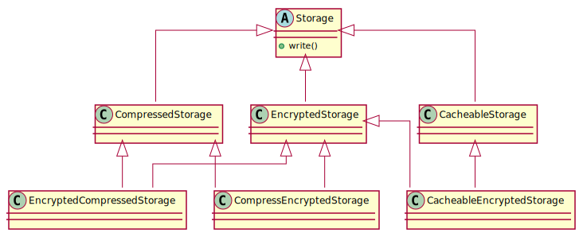
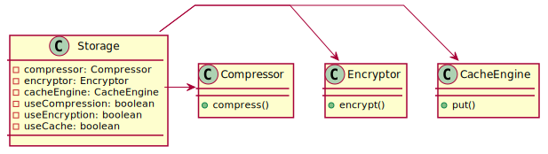

# Ch04 재사용: 상속보단 조립

## 1 상속과 재사용
- 상속을 사용하면 다른 클래스의 기능을 재사용하면서 추가 기능을 확장할 수 있음

### 1.1 상속을 통한 재사용의 단점 1, 상위 클래스 변경의 어려움
- 변경의 여파가 계층도를 따라 전파되므로, 상위 클래스의 변경을 어렵게 만듬

### 1.2 상속을 통한 재사용의 단점 2, 클래스의 불필요한 증가

### 1.3 상속을 통한 재사용의 단점 3, 상속의 오용
코드 참고

## 2 조립을 이용한 재사용
- 객체 지향 언어에서 객체 조립은 보통 필드에서 다른 객체를 참조하는 방식으로 구현된다

- 조립 방식의 또 다른 장점은 런타임에 조립 대상 객체를 교체할 수 있다는 것이다

# 2.1 위임
# 2.2 상속은 언제 사용하나?
- 상속을 사용할 때는 재사용이라는 관점이 아닌 **기능의 확장**이라는 관점에서 상속을 적용해야 한다
- 또한 추가로 IS-A 관계가 성립되어야 한다

