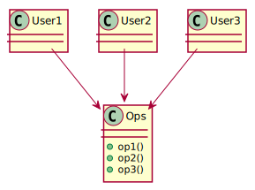
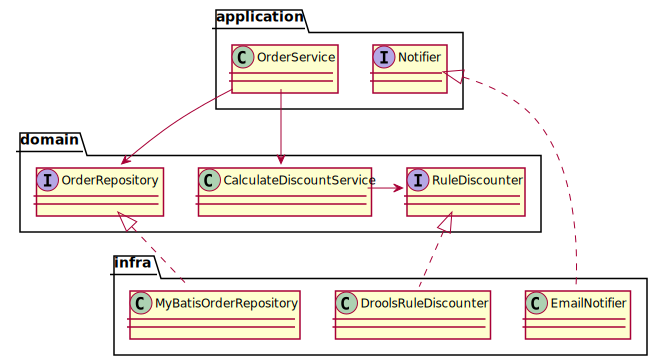

# Ch05 SOLID

- 높은 응집, 낮은 결합
- 여러 코드를 오가며, 프로그램을 파악하고 있는가?
- import에 다른 패키지가 자주 등장하는가?

## SRP 단일 책임 원칙

- 단일 모듈은 변경의 이유가 하나, 오직 하나뿐이어야 한다
- 하나의 모듈은 하나의, 오직 하나의 사용자 또는 아해관계자에 대해서만 책임져야 한다
- 하나의 모듈은 하나의, 오직 하나의 액터에 대해서만 책임져야 한다

- 모듈이란? 소스코드, 즉 함수와 데이터 구조로 구성된 응집된 집합
- 단일 액터를 책임지는 코드를 함게 묶어주는 힘이 바로 응집성이다

### 징후 1: 우발적 중복


### 징후 2: 병합

- SRP를 위반하면 코드 병합시 충돌이 많음

### 해결책


## OCP 개방-폐쇄 원칙

- 소프트웨어 개체<sub>artifact</sub>는 확장에는 열려 있어야 하고, 변경에는 닫혀 있어야 한다
- 소프트웨어 개체의 행위는 확장할 수 있어야 하지만, 이때 산출물을 변경해서는 안된다
- 기능을 변경하거나 확장할 수 있으면서, 그 기능을 사용하는 코드는 수정하지 않는다


- A 컴포넌트에서 발생한 변경으로부터 B 컴포넌트를 보호하려면 반드시 A 컴포넌트가 B 컴포넌트에 의존해야 한다
- 그림은 `Presenter`에서 발생한 변경으로부터 `Controller`를 보호하고자 한다
- 그리고 `View`에서 발생한 변경으로 부터 `Presenter`를 보고하고자 한다
- `Interactor`는 다른 모든 것에서 발생한 변경으로부터 보호하고자 한다. `Interactor`는 OCP를 가장 잘 준수할 수 있는 곳에 위치한다. `Database`, `Controller`, `Presenter`, `View`에서 발생한 어떤 변경도 `Interactor`에 영향을 주지 않는다
- 왜? `Interactor`는 업무규칙을 포함하기 때문... 즉, 애플리케이션에서 가장 높은 수준의 정책을 포함한다 `Interactor` 입장에서는 `Controller`가 부수적이지만, `Controller`는 `Presenter`와 `View`에 비해서는 중심적인ㅇ 문제를 담당한다

### 개방 폐쇄 원칙이 깨질 때의 주요 증상

- 다운 캐스팅을 한다
- 비슷한 if-else 블록이 존재한다

> 앞서 `FlowController`와 `ByteSource` 예에서 보듯이, 개방 폐쇄 원칙은 **변화되는 붑누을 추상화**(`ByteSource` 인터페이스)함으로써 사용자(`FlowController`) 입장에서 **변화를 고정**시킨다. 이를 통해 사용자가 `ByteSource`의 확장에 폐쇄적일 수 있도록 만들어 준다

## LSP 리스코프 치환 원칙

- `S` 타입의 객체 `o1` 각각에 대응하는 `T`타입 객체 `o2`가 있고, `T`타입을 이용해서 정의한 모든 프로그램 `P`에서 'o2'의 자리에 `o1`을 치환하더라도 `P`의 행위가 변하지 않는다면 `S`는 `T`의 하위 타입이다
- 상위 타입의 객체를 하위 타입의 객체로 치환해도 상위 타입을 사용하는 프로그램은 정상적으로 동작해야 한다

```java
public void someMethod(SuperClass sc) {
    sc.anotherMethod();
}

someMethod(new SubClass());
```

### 상속을 사용하도록 가이드하기


### 정사각형/직사각형 문제


### 리스코프 치환 원칙은 계약과 확장에 대한 것

- 명시된 명세에서 벗어난 값을 리턴한다
- 명시된 명세에서 벗어난 예외를 발생한다
- 명시된 명세에서 벗어난 기능을 수행한다

## ISP 인터페이스 분리 원칙

- 자신이 사용하는 메서드에만 의존해야 한다
- 클라이언트 입장에서 인터페이스를 분리하라




- `User1`의 소스 코드는 `U1Ops`와 `op1()`에 의존하지만 `Ops`는 의존하지 않게 된다. 따라서 `Ops`에서 발생한 변경이 `User1`과는 전혀 관계없는 변경이라면, `User1`을 다시 컴파일하고 새로 배포하는 상황은 초래하지 않는다
- `import`, `use`, `include`와 같은 타입 선언문으로 인해 소스 코드 의존성이 발생하고, 이로 인해 재컴파일 또는 재배포가 강제되는 상황을 초래한다

## DIP 의존 역전 원칙

- 고수준 모듈은 저수준 모듈의 구현에 의존해서는 안된다. 저수준 모듈이 고수준 모듈에서 정의한 추상 타입에 의존해야 한다



- 제어흐름은 소스 코드 의존성과는 정반대 방향으로 바뀐다. 다시 말해 소스 코드 의존성은 제어흐름과는 반대 방향으로 역전된다

### 안정된 추상화

- 변동성이 큰 구체 클래스를 참조하지 말라; 대신 추상 인터페이스를 참조하라, 바꾸어 말하면 `import` 구문에 추상 클래스만 있어야 한다
- 변동성이 큰 구체 클래스로부터 파생하지 말라; 상속을 피하라
- 구체 함수를 오버라이드 하지 말라; 차라리 추상 함수를 오버라이드하라

- e.g. `String` 클래스는 매우 안정적이다; 운영체제나 플랫폼 같이 안정성이 보장된 환경에 대해서는 무시해도 좋다, 즉, 이들 환경에 대한 의존성은 용납하는데, 그 이유는 잘 변경되지 않는다면 의존해도 괜찮다는 사실을 알기 때문이다
