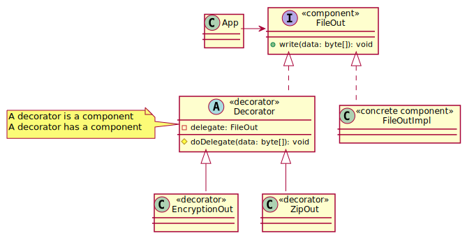
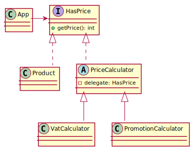
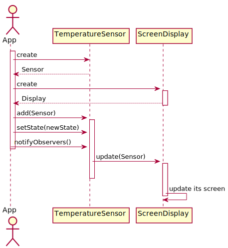
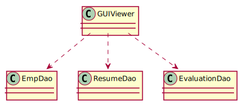
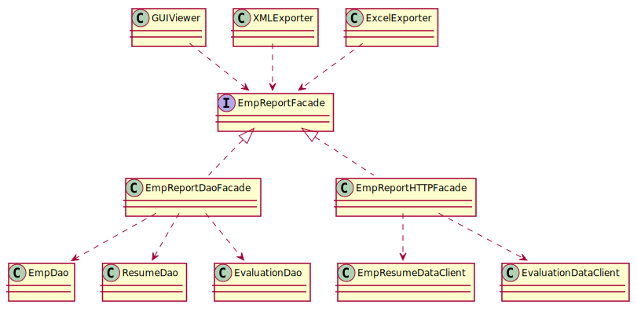
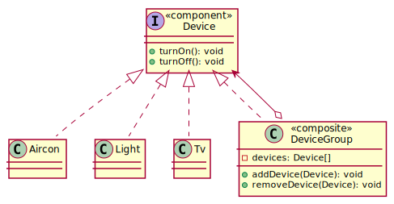
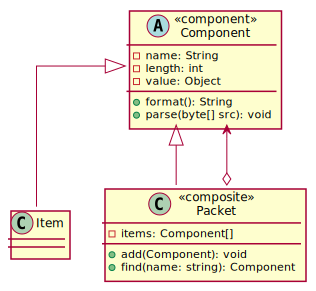

# Ch07 주요 디자인 패턴

## 2 전략 패턴


## 3 템플릿 메서드 패턴

## 4 상태 패턴


## 5 데코레이터 패턴

- 상속의 문제점: 다양한 조합 기능 확장이 요구될 때 클래스가 불필요하게 증가하는 문제
- 데코레이터: 위임하는 방식으로 기능 확장, 조립 순서의 자유도
- 키워드: **change behavior(additioanl responsibility)** at runtime without changing the component



### Pizza example
- 가장 기본이 되는 클래스를 안쪽에 위치시키고 순차로 랩핑
- The ToppingDecorator is a Pizza type, and has a Pizza type


### PriceCalculator example



```java
HasPrice product = new Product(1, "옥토끼 별사탕", 100);
HasPrice innerCalculator = new PromotionCalculator(product, 0.3); // 30% OFF
HasPrice outerCalculator = new VatCalculator(promotionCalculator, 0.1); // 10% VAT
outerCalculator.getPrice(); // 100 * (1 - 0.3) * 0.1 = 77(원)
```

### ExtraFee example


```java
ExtraFeeFilter innerFilter = new WeeklyHourExtraFeeFilter(store);
ExtraFeeFilter middleFilter = new RegionExtraFeeFilter(firstFilter, regionalExtraFeeCollector, destAddress);
ExtraFeeFilter outerFilter = new WeatherExtraFeeFilter(middleFilter, store, vroongWeatherExtraChargeDtoRepository);
outerFilter.getActiveExtraFee(); // [{name:심야할증,fee:300},{name:삼성동할증,fee:100},{name:우천할증,fee:200}]
```


## 6 프록시 패턴

Provides a surrogate or placeholder for another object to **control access** to it.

The Proxy could interface to anything; a network connection, a large object in memory, a file, or some other resource that is expensive or impossible to duplicate. [reference](https://dzone.com/articles/using-proxy-design-pattern-in-java)

- 비싼 객체에 대한 지연 로딩; The Proxy is most commonly used in the implementation of the lazy loading of objects. I mean creating proxy objects in place of full real objects until it is actually needed.
- Proxy 객체가 Real 객체를 가지고 있음


### PremiumService example

- 보호된 리소스에 대한 접근 제어; The Proxy can also be used to add an additional layer of security around the real object.


### Multitenancy Datasource example


```java
@Component
@Primary
public class CacheableTenantDataSourceProvider implements TenantDataSourceProvider {
  @Override
  @SuppressWarnings("unchecked")
  public List<TenantDataSource> findAll() {
    Cache.ValueWrapper value = cache.get(CacheKey.TENANT_DATA_SOURCE_ALL);
    if (value != null) {
      return (List<TenantDataSource>) value.get();
    }

    List<TenantDataSource> configList = this.delegate.findAll();
    this.cache.put(CacheKey.TENANT_DATA_SOURCE_ALL, configList);

    return configList;
  }
}
```

## 7 어댑터 패턴

- An adapter call the adaptee, calls indirectly
- Make incompatible objects compatible
- Not adding behavior, just make it interoperable


## 8 옵저버 패턴

- When you need many other objects to receive an update when other object changes
- Subject or Observable: publisher, Observer: subscriber

### Sensor example

> `A`와 `B` 두 개의 객체가 있을 때, `B`가 `A`의 상태를 알고 싶다고 가정해보죠. 가장 쉬운 방법은 `B`가 주기적으로 `A`에게 물어보는 겁니다. "지금 너의 상태는 뭐니? 지난 물어봤을 때랑 데이터가 달라졌니?" 처럼요. 그런데 `B`처럼 `A`의 상태를 알고 싶어하는 객체가 1만개 정도이고, 1초에 한번씩 물어본다고 가정해보죠. 게다가 좀 더 극단적으로 `A`의 상태는 하루에 한 번 정도만 변경된다고 해보죠. 그럼 [(1만 객체 x 60회/분 x 60분 x 24시간) - 1만 유효 메시징] 만큼의 요청은 쓸 데없는 요청인 셈입니다. 폴링(polling) 방식의 문제점이죠.
>
> 반면에 푸쉬(push)방식을 살펴볼까요. `A`의 상태 변경을 알고 싶어하는 객체의 목록을 `A`가 가지고 있다면, `A`는 자신의 상태가 변경될 때 마다 목록에 등록된 객체들에게 변경 사실을 통지할 수 있을 겁니다. 이제 `A`는 자신의 상태가 변경됐을 때, 즉 하루에 딱 한번만 `B`와 그 친구들과의 메시지을 보냅니다. 낭비가 현격히 줄어든 셈이죠.
> 
> 앞서 언급한 푸쉬 방식을 위한 패턴이 옵저버입니다. 이 예제에서는 온도와 습도 센서가 스크린 디스플레이 및 로그 기록장치와 메시징하는 시나리오입니다. 센서는 `A`, 디스플레이 및 로거는 `B`입니다. 옵저버 패턴에서 `A`를 `Observable` 또는 `Subject`라 하고, `B`를 `Observer`라고 부릅니다.




### Multitenancy Datasource example


```java
public class CacheableTenantDataSourceProvider implements Observable {
  @Override
  @SuppressWarnings("unchecked")
  public List<TenantDataSource> findAll() {
    Cache.ValueWrapper value = cache.get(CacheKey.TENANT_DATA_SOURCE_ALL);
    if (value != null) {
      return (List<TenantDataSource>) value.get();
    }

    List<TenantDataSource> configList = this.delegate.findAll();
    this.cache.put(CacheKey.TENANT_DATA_SOURCE_ALL, configList);

    return configList;
  }

  @Override
  public void refresh() {
    this.cache.evictIfPresent(CacheKey.TENANT_DATA_SOURCE_ALL);
    this.findAll();
    this.setChanged();
    this.notifyObservers();
  }
}
```
```java
public class DataSourceBasedMultiTenantConnectionProviderImpl
    implements Observer {
  @PostConstruct
  public void load() {
    List<TenantDataSource> configList = tenantDataSourceProvider.findAll();
    for (TenantDataSource config : configList) {
      tenantDataSourceMap.putIfAbsent(
          config.getTenantId(), this.tenantDataSourceMapper.toDataSource(config));
    }
  }

  @Override
  public void update(Observable o, Object arg) {
    this.load();
  }
}
```

## 9 미디에이터 패턴

- Handle **complex communications** between related objects, helping with decoupling of those objects
- GoF: Allows loose coupling by encapsulating the way disparate sets of objects interact and communicate with each other
- The Mediator defines the interface for communication between Colleague objects. The ConcreteMediator implements the Mediator interface and coordinates communication between Colleague objects. It is aware of all the Colleagues and their purpose with regards to inter communication. **The ConcreteColleague communicates with other colleagues through the mediator.**

> **An airport control tower** is an excellent example of the mediator pattern. The tower looks after who can take off and land - all communications are done from the airplane to control tower, rather than having plane-to-plane communication. This idea of a central controller is one of the key aspects to the mediator pattern.

> 기사와 상점은 **MCC**를 통해 서로 소통합니다


#### 요구사항

- `VideoListUI`에서 비디오를 선택하면
  - `TitleUI`는 제목을 표시한다
  - `VideoPlayer`는 영상을 재생한다
- `MediaController`에서 재생/멈춤 버튼을 누르면
  - `VideoPlayer`는 영상을 재생하거나 멈춘다
- `MediaController`의 시간 이동을 조작하면
  - `VideoPlayer`는 알맞은 위치로 이동해서 영상을 재생한다
- `MediaController` 다음/이전 버튼을 누르면
  - `VideoListUI`의 다음 또는 이전 영상을 재생한다
- `VideoPlayer`의 화면을 터치하면
  - 영상 재생이 멈추거나 재개된다
  - 이때 `MediaController`의 버튼도 재생/멈춤 모양으로 바뀐다

#### 각 구성 요소가 직접 연결된 구조


- 재사용이 어렵다: `MediaController`와 `VideoController`가 강결합되어있으므로, MP3 플레이어를 만들때 재사용할 수 없다
- 요구사항이 추가되어 클래스가 증가하면 개별 클래스의 수정이 어려워진다


#### 미디에이터를 적용한 구조

- 미디에이터 패턴은 각 객체들이 직접 메시지를 주고받는 대신, 중간에 중계 역할을 수행하는 미디에이터 객체를 두고, **미디에이터를 통해서 각 객체들이 간접적으로 메시지를 주고 받도록 한다**
- 각 협업 객체가 서로 알 필요없이 미디에이터가 각 객체 간의 메시지 흐름을 제어하기 때문에, 새로운 협업 객체가 추가되더라도 기존 클래스를 수정할 필요없이 미디에이터 클래스만 수정하면 된다
- 반면, 협업 클래스의 개수가 증가할수록 미디에이터의 코드는 복잡해지는 단점이 있다


#### 추상 미디에이터 클래스의 재사용


### Chat example


## 10 파사드 패턴

- Provides unified interface to a set of interfaces in a subsystem. Facade defines high-level interface that makes subsystem easier to use
- **서브시스템을 감춰주는 상위 수준의 인터페이스 제공**

#### 파사드 패턴 적용 전



#### 새로운 요구사항

- `GUIVidewer`, `XMLExporter`, `ExcelExporter` 사이에 코드 중복 발생; 각 클래스간의 미세한 차이로 인해 프로그램 버그 유발 가능성
- `EmpDao`, `ResumeDao`, `EvaluationDao`에 직접 의존하는 문제; Dao의 변화가 상위 정책 코드에 영향을 미침


#### 파사드 적용


#### 인터페이스 적용

파사드를 인터페이스로 정의하면 클라이언트의 변경없이 서브시스템 자체를 변경할 수 있음



### Shopping example


## 11 추상 팩토리


## 12 컴포지트



### TCP 전문 해석 Example



[https://github.com/meshkorea/vroong-cuadaptor/pull/38/files](https://github.com/meshkorea/vroong-cuadaptor/pull/38/files)

