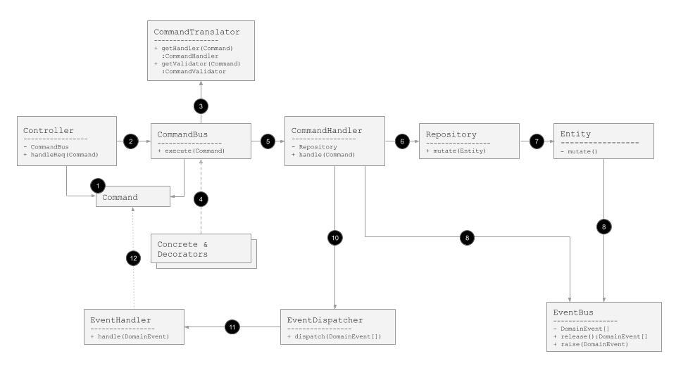

## Command Oriented Architecture

원본그림: https://docs.google.com/presentation/d/1oKYAFLYQj7zWpzjJTP0uvTLc8TZI731tqiz5BpjsvZw/edit?usp=sharing

1. 커맨드 객체를 생성한다 e.g. `PlaceOrderCommand`
2. 커맨드버스에 태운다 e.g. `CommandBus.execute(cmd): void`
3. 커맨드핸들러 객체를 구한다 e.g. `CommandTranslater.getHandler(cmd): PlaceOrderCommandHandler`
4. (선택) 필요에 따라 커맨드버스의 기능을 확장할 수 있다 e.g. `ValidatingCommandBus extends CommandBus`,  `CommandTranslater.getValidator(cmd): PlaceOrderCommandValidtor`
5. 핸들러를 호출한다 e.g. `PlaceOrderCommandHandler.handle(cmd)`
6. 리포지토리를 이용해서 도메인 엔티티를 변경한다 e.g. `OrderRepository.create(cmd): Order`
7. ...
8. 엔티티는 도메인이벤트를 raise 한다 e.g. `EventBus.raise(OrderCreatedEvent)` 
9. 커맨드핸들러가 도메인이벤트를 release 한다 e.g. `EventBus.release(): DomainEvent[]`
10. 커맨드핸들러가 이벤트디스패처에 release된 도메인 이벤트를 태운다 e.g. `EventDispatcher.dispatch(DomainEvent[])`
11. (프레임워크 등을 통해 미리 등록된) 이벤트 핸들러가 도메인이벤트를 처리한다 e.g. `EventHandler.handle(DomainEvent)`
12. 이벤트핸들링하는 과정에 새로운 커맨드를 만들어 커맨드 버스에 태울수도 있다 
