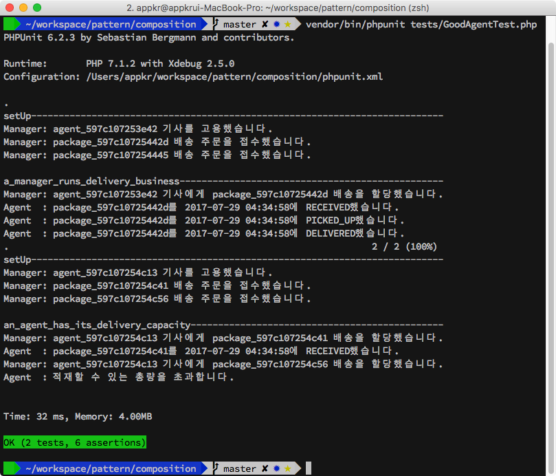

## Composition (조립)

다음은 객체지향의 가장 큰 특징 세가지입니다.

1. 캡슐화(encapsulation)
2. 상속(inheritance)
3. 다형성(polymorphism)

객체지향의 이런 특징을 활용하면서, 변경되는 요구사항에 대응할 수 있는 설계 방법으로 고안된 고수준의 원칙이 [SOLID](https://en.wikipedia.org/wiki/SOLID_(object-oriented_design))입니다. 그리고 그 SOLID를 구체화한 것이 [디자인 패턴](https://en.wikipedia.org/wiki/Software_design_pattern)입니다. 

객체지향을 처음 배울때는 OO의 특징 > SOLID > 패턴 순으로 배우지만, 정작 패턴은 더 고수준의 원칙을 모르는 초급 개발자도 쉽게 따라 구현할 수 있는 테크닉이며, (개발자로서 경험이 더 쌓일수록) 더 추상적인 OO의 특징을 살린다는 것이 훨씬 더 어렵다는 것을 알게 되는 것 같습니다. 

상속은 결합도가 가장 높은 의존입니다. 이 예제에서는 상속이 가진 문제점이 무엇이고, 조립을 통해서 어떻게 해결하는지를 보여줍니다.

### 1. 설치 및 실행

저장소 복제 후에..

```bash
~/pattern $ composer install
~/pattern $ vendor/bin/phpunit Basic/Composition/tests/BadAgentTest.php
~/pattern $ vendor/bin/phpunit Basic/Composition/tests/GoodAgentTest.php
```

### 2. 가상의 시나리오

이 가상의 프로젝트에는 총 세 개의 객체가 등장합니다.

- `DeliveryManager`(배송 매니저 =~ 고용주)
- `DeliveryAgent`(배송 기사 =~ 직원)
- `Package`(배송할 목적물)

유스케이스는 다음과 같습니다.

- `DeliveryManager`는 한 명 이상의 `DeliveryAgent`를 고용하여 배송 대행 사업을 하고 있습니다.
- (누군지 모르는) 고객은 `DeliveryManager`에게 `Package` 배송 요청을 하고, `DeliveryManger`는 배송 요청을 접수 받습니다.
- `DeliveryManager`는 `Package` 배송 요청을 `DeliveryAgent`에게 할당합니다.
- 각 `DeliveryAgent`는 한 번에 수행할 수 있는 `Package[]`의 크기와 무게를 가지고 있습니다(=~Capacity).
- `DeliveryAgent`는 `Package`의 배송 상태가 변경되면 `DeliveryManager`에게 완료 사실을 보고하고, 완료하면 완료한 만큼의 Capacity를 다시 회복할 수 있습니다.



### 3. Bad

```php
<?php // Basic/Composition/src/Bad/DeliveryAgent.php

class DeliveryAgent extends Collection implements Agent
{
    public function receive(Package $package): void
    {
        if (! $this->canReceive($package)) {
            throw new UnableToLoadPackageException('적재할 수 있는 총량을 초과합니다.');
        }

        $package->updateDeliveryStatus('RECEIVED');
        $this->push($package);
        $this->manager->reportPackageDeliveryStatus($package);
    }
    
    public function canReceive(Package $package): bool
    {
        $test1 = $package->getSize() + $this->getCurrentLoadSize() <= $this->bucketSize;
        $test2 = $package->getWeight() + $this->getCurrentLoadWeight() <= $this->maxLoadWeight;

        return $test1 && $test2;
    }
}
```

설계자는 자신의 설계를 사용하는 개발자가 `DeliveryManager::assignDeliveryJobTo()` 함수 호출을 통해 `$package` 배송 요청을 할 것이라고 생각했습니다.

```php
<?php // Basic/Composition/src/Common/DeliveryManager.php

class DeliveryManager
{
    public function assignDeliveryJobTo(Agent $agent, Package $package): void
    {
        try {
            $agent->receive($package);
        } catch (Exception $e) {
            // ...
        }
    }
}
```

그러나, 여기서 상속의 함정에 빠지게 됩니다. 개발자는 언제든 `DeliveryManager::assignDeliveryJobTo()` 함수 또는 `DeliveryAgent::receive()` 함수를 거치지 않고, `DeliveryAgent`의 부모 클래스인 `Collection`의 `push()` 함수를 직접 호출할 수 있다는 사실!!! 


```php
<?php // Basic/Composition/tests/BadAgentTest.php

class BadAgentTest extends TestCase
{
    /** @test */
    public function an_agent_has_been_overloaded_but_the_business_still_runs()
    {
        $this->printSeparator(__FUNCTION__);
        $this->deliveryManager->assignDeliveryJobTo($this->deliveryAgent, $this->package1);

        $this->deliveryAgent->push($this->package2);

        $message =<<<EOT
원래 이곳에서 UnableToLoadPackageException이 발생해야 합니다.
 예외는 발생하지 않았습니다. 이유는 DeliveryAgent::receive() 함수를 사용하지 않고, 
 DeliveryAgent의 부모 클래스인 Collection::push() 함수를 직접 사용해서 
 배송 주문을 추가했기 때문입니다. 
 이 경우 배송 기사의 최대 적재량을 초과해서 배송을 할당하게 될 수 있습니다.
EOT;
        $this->markTestIncomplete($message);
    }
}
```

#### 3.1. 무엇이 문제?

최대 적재량과 중량을 검사하는 `DeliveryAgent::canReceive()` 함수를 실행하지 않았고, `$package` 의 배송 상태를 업데이트하고, 그 상태를 매니저에게 보고하는 모든 과정을 건너 뛰었습니다.

비즈니스 규칙이 깨진거죠. 현실 세계에서 배송 기사는 어떻게 생각할까요? '내가 한 번에 배송할 수 있는 사이즈와 최대 무게가 얼만지 모를 수도 있지~'. 그런데, 이런 일이 계속되면, '지금은 내 버킷에 담을 수가 없으니, 지금 있는 배송들 좀 처리하면 픽업해야지~'. 당연히 배송 시간은 길어지고, 서비스에 대한 소비자의 신뢰도는 떨어지겠죠. (좀 너무 나갔다 싶긴한데) 배송 기사는 퇴사하고, 배송 기사뿐아니라 고객도 나쁜 입소문을 내고, 이러다 결국 망하는 겁니다.

왜 이런 일이 발생한 걸까요? `DeliveryAgent`가 `Collection`이 아닌데, `Collection`인 것 처럼 행세해서 그렇습니다. 팀에 새로 합류한 동료가 설계자의 의도한 함수를 바로 캐치하고 사용할 수 있을까요?


이건 누구의 잘못일까요? 설계자? 아니면 잘못 사용한 새로온 동료?

#### 3.2. 라라벨

라라벨은 잘 짠 프레임워크라 하지만, 경험으로 봤을 때 곳곳에 지뢰가 깔려 있습니다.

가령 폼리퀘스트를 볼까요? `UpdatePostRequest`란 폼 리퀘스트에서 클라이언트가 Empty String(`""`)을 제출하면, `null`로 치환해야 한다고 해 보죠.

```php
<?php // app/Http/Requests/UpdatePostRequest.php

public function nullIfEmptyString('field')
{
    $value = $this->input('field', null);
    return (mb_strlen(trim($value)) > 0) ? $value : null;
}
```

그런데, 문제는 `UpdatePostRequest` 객체를 주입받은 컨트롤러에서 부모 클래스의 `FormRequest::input()`을 직접 호출할 수 있다는 거죠. 실제로 클라이언트가 `""`를 제출했다면, `null`로 치환되지 않아 타입 오류가 발생했거나, DB 컬럼에 `NULL`이 저장되어야 하는데 `""`이 저장되어 나중에 DB의 컬럼 값을 꺼내 쓰는 기능에서 치명적인 오류가 발생할 수 있습니다.

사실 이 문제는 엘로퀀트를 상속한 모델에서 가장 심각하게 나타납니다. 엘로퀀트를 상속한 도메인 모델 안에 위의 예에서 본 것과 같이 적재량을 초과하면 예외를 발생시켜 완전함을 유지하려는 함수가 있음에도 불구하고, 저수준의 엘로퀀트 함수를 직접 호출함으로써 도메인의 규칙을 완전 망가뜨릴 수 있기 때문입니다.

### 4. Good

(쓰다보니, 길어져서 블로그로 쓸 걸 그랬나봐요 ㅜ)

해결법은 조립입니다. 예제 소스 코드에서 `Bad\DeliveryAgent`와 `Good\DeliveryAgent`를 양 쪽에 놓고 비교해 보면 변경 내용이 거의 없다는 것을 금방 알아차릴 수 있습니다. `DeliveryAgent::$bucket`란 필드 변수를 만들고, `$this->push()`처럼 부모 클래스의 함수를 사용하는 것이 아니라, `$this->bucket->push()`처럼 필드 변수에 저장된 객체의 함수를 호출하는 정도이기 때문입니다. 대신, `$this->bucket`은 `private`로 선언되어 있어 외부에서 접근할 수 없습니다. 즉, 3절의 Bad와 같은 황당한 일이 벌어질 수 없습니다.

```php
<?php // Basic/Composition/src/Good/DeliveryAgent.php

class DeliveryAgent implements Agent
{
    private $bucket;

    public function __construct() 
    {
        $this->bucket = new Collection;
    }
    
    public function receive(Package $package): void
    {
        if (! $this->canReceive($package)) {
            throw new UnableToLoadPackageException('적재할 수 있는 총량을 초과합니다.');
        }

        $package->updateDeliveryStatus('RECEIVED');
        $this->bucket->push($package);
        $this->manager->reportPackageDeliveryStatus($package);
    }
}
```


### 5. 그럼 상속은 언제 사용해야할까요?

흠... 저도 잘 모르고, 그래도 제가 아는 내용을 쓰면, 안 찾아 보실 듯 해요.
