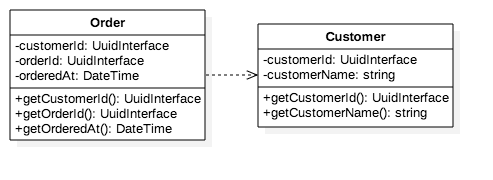
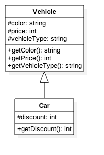
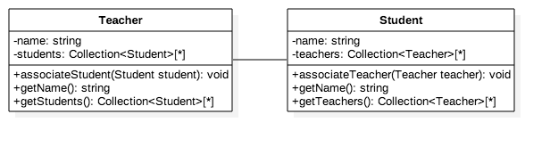
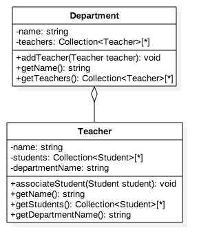
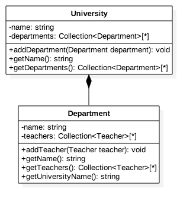

## 의존이란?

다음과 같을 때 두 클래스간의 결합도(의존성)가 높다고 할 수 있습니다.

- `A`가 자신의 클래스 속성으로 `B` 타입을 가지고 있을 때
- `A`가 `B` 객체에서 제공하는 서비스(==함수)를 호출할 때
- `A`가 제공하는 함수에서 `B` 타입을 파라미터로 받거나, `B` 타입을 반환할 때
- `A`가 `B`의 서브 타입이거나 구현체일 때

### 1. 의존 (Dependency)

A 클래스가 B 클래스를 참조합니다. B 클래스의 객체를 A 클래스 안에서 생성한다든가, B 클래스의 객체를 생성자 또는 함수의 인자로 받아 B 클래스의 함수에 접근하는 경우를 말합니다. 



아래 UML에서는 `Customer` 객체에 의존성을 최소화 하기 위해 `Order` 클래스의 생성자에서 `Customer::getCustomerId()` 함수만 호출함으로써 `Customer` 객체에 온전히 접근할 수 있을 때 오용될 가능성을 최소화하고 있습니다. 가령 `Order` 객체 안에서 `$this->customer->somePublicFUnctionThatChangesStateOfCustomer()`와 같이 사용할 수 있게되고, 이는 설계 원칙에 어긋납니다.

`Order`와 `Customer` 엔티티의 상태를 동시에 변경해야 할 때는 서비스 레이어에서 리포지터리를 통해서 조회한 후 원하는 동작을 하는 것이 더 낫습니다. 반면, `Order[]`를 처리해야 한다면, 처리해야 할 `Order` 목록을 조회하는 쿼리와 각 `Order`를 조회하는 쿼리를 해야 하므로 N + 1 문제가 발생합니다. 상태를 변경하는 쿼리라면, 모든 모델이 무결한 상태에서 처리하는 것이 좋으므로 괜찮지만, 단순 조회만 할 때는 리포지터리에 조회 전용 메서드를 만드는 것이 더 낫습니다. 
    
## 2. 일반화/실체화 (Generalization, Realization)

A 클래스가 B 클래스를 상속하거나, A 클래스가 B 인터페이스를 구현합니다. `is-a` 관계라고 하기도 합니다.

그림에서는 `Car` 클래스가 `Vehicle` 클래스를 상속하고 있습니다. 이제 `Car` 객체는 `Vehicle::$color`, `Vehicle::$price` 등의 변수에 접근할 수 있습니다. 예제에서 `Car::getPrice()` 함수처럼 부모 클래스의 함수를 재정의(Override)할 수도 있습니다. `Vehicle` 클래스에서 더 이상 `$price` 변수를 쓰지 않기로 했다고 가정해 볼까요? 이제 `Car::getPrice()`는 `null - 100 = -100`과 같이 예상치 못한 값을 반환하게됩니다.



## 3. 연관 (Association)

정리 중..



`Teacher` 객체의 내부 상태를 보호하기 위해 `return $this->students->toBase()`처럼 사본을 반환합니다. 이렇게 함으로써 `associateStudent()` API를 통해서만 `Teacher`에 `Student`를 추가할 수 있습니다. `getStudents()` API에서 `Collection $students` 변수를 직접 노출하면, 다른 객체에서 `$teacher->getStudents()->push(new Student('foo'))`와 같이 `associateStudent()` 함수를 거치지 않고도 `Student`를 추가할 수 있습니다. 이는 객체 내부의 데이터를 일관되지 않게 오염시키므로, 설계할 때 주의해야 합니다.

```php
<?php

namespace Basic\Dependency;

use Illuminate\Support\Collection;

class Teacher
{
    private ...
    public function __construct(string $name, Department $department){...}
    public function associateStudent(Student $student){...}
    public function getName(){...}
    public function getStudents()
    {
        return $this->students->toBase();
    }
    public function getDepartmentName(){...}
}
```

### 3.1. 집합연관 (Aggregation)

정리 중..



### 3.2. 합성연관 (Composition)

정리 중..



## 참고자료

- http://www.c-sharpcorner.com/UploadFile/b1df45/dependency-generalization-association-aggregation-compos/
- http://www.nextree.co.kr/p6753/
- https://en.wikipedia.org/wiki/Coupling_(computer_programming)#Solutions
