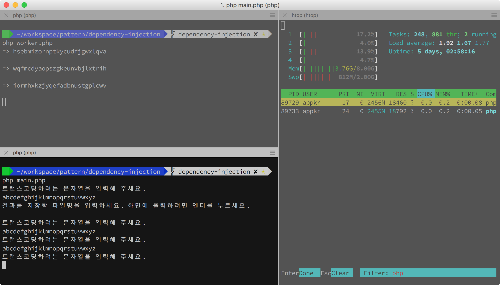
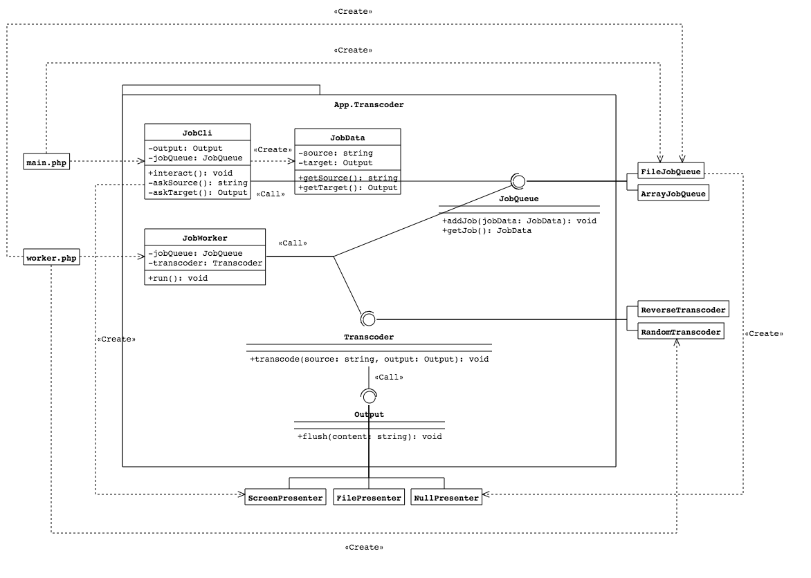
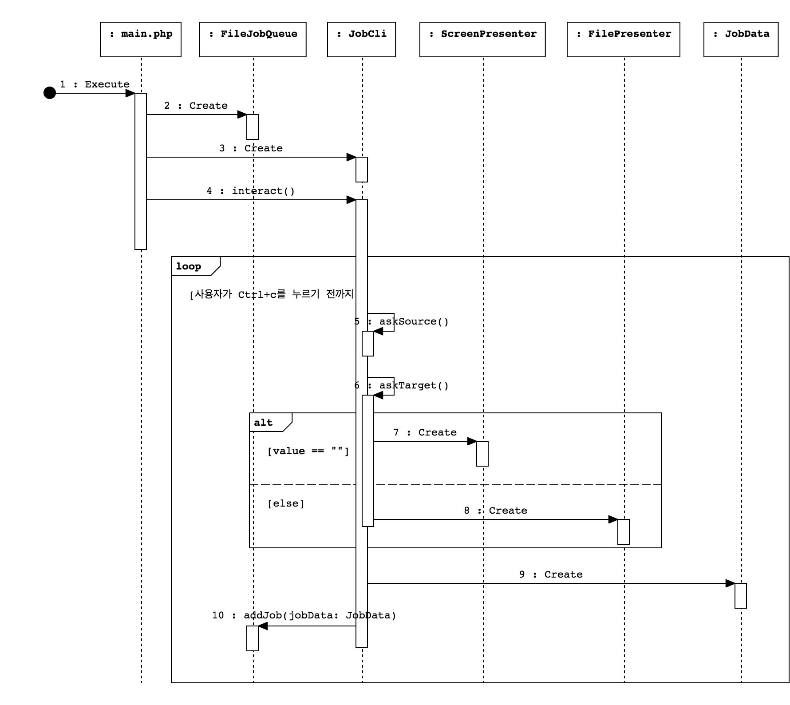
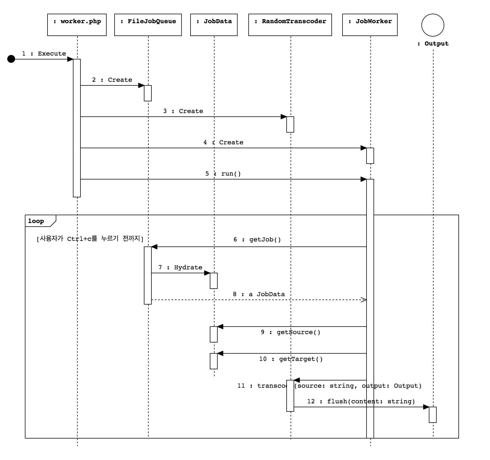

## Dependency Injection

의존성 주입(Dependency Injection) 구현을 연습하기 위한 프로젝트입니다.

### 1. 가상의 시나리오

[Service Locator](https://github.com/appkr/pattern/tree/master/Basic/ServiceLocator)와 같은 예제입니다. 이전 예제와 조금 달라진 점은 PHP의 싱글 쓰레드 한계를 극복하기 위한 방법으로 다른 프로세스에서 워커를 구동할 수 있도록 기능을 추가했습니다.

```bash
~/pattern $ composer install
# 콘솔 1번
~/pattern $ php Basic/DependencyInjection/main.php
# 콘솔 2번
~/pattern $ php Basic/DependencyInjection/worker.php
```



### 2. 의존성 주입

[Service Locator](https://github.com/appkr/pattern/tree/master/Basic/ServiceLocator)를 사용하는 대신 의존성 주입 방식으로 애플리케이션을 구동합니다.

애플리케이션 런타임에 필요한 구현체를 메인 영역에서 생성자를 통해 주입해 줍니다. 이 예제에서 `JobCli`는 자신에게 주어진 책임을 수행하기 위해 `JobQueue` 타입의 객체를 필요로하는데, `main.php` 에서 `JobCli` 객체를 생성할 때 생성자의 인자로 넣어 줍니다. 마찬가지로, `JobWorker`는 `JobQueue`와 `Transcoder` 타입의 객체를 필요로 하는데, `worker.php`에서 주입해 줍니다.

이 예제에서 메인 영역은 `main.php`와 `worker.php`이며, `src/` 폴더 아래의 클래스들은 전부 애플리케이션 영역입니다.

주입해준다는 의미는 다음과 같습니다. 

1. 메인 영역에서 `JobQueue` 타입의 `FileJobQueue` 객체를 생성해서 넣어 주는데요. 런타임에 어떤 조건에 따라 `FileJobQueue` 대신 `SqsJobQueue`를 넣어 줄 수도 있습니다. 
2. 그리고, 애플리케이션 영역의 클래스들은 `JobQueue` 타입을 기대하고 있으며, 메인 영역에서 넣어준 객체가 `FileJobQueue`든 `SqsJobQueue`은 몰라도 되고 알 필요도 없습니다. 단지, `JobQueue` 인터페이스에 정의된 `addJob()`, `getJob()` API를 필요한 시점에 호출하기만 할 뿐입니다.
3. 테스트 관점에서 `JobQueue` 타입의 모의 객체를 이용하면, 파일시스템이든 외부서비스든 IO에 의존성 없이 메모리에서 작동 테스트를 할 수 있습니다.






