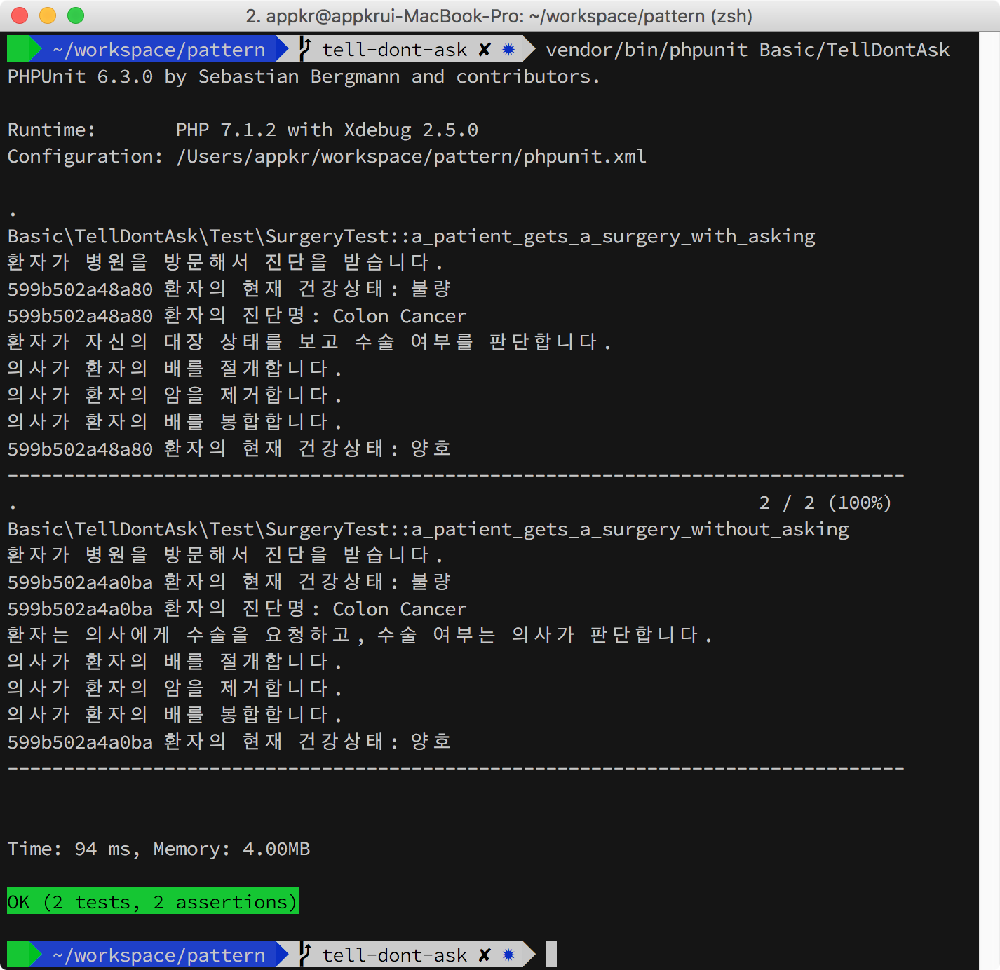
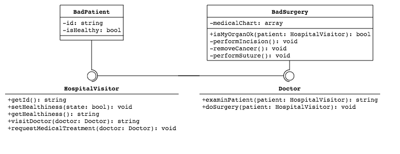
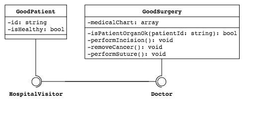

## Tell Don't Ask

'묻지 말고 명령하라'는 원칙입니다. [Law of Demeter](https://en.wikipedia.org/wiki/Law_of_Demeter), [Command Query Separation](https://en.wikipedia.org/wiki/Command%E2%80%93query_separation) 디자인 원칙들과도 관련이 있습니다.

### 1. 설치 및 실행

```bash
~/pattern $ composer install
~/pattern $ vendor/bin/phpunit Basic\TellDontAsk
```



### 2. 나쁜 코드

환자가 병원을 방문해서, 대장암 판정을 받고, 수술하는 시나리오입니다. 어떤 분의 표현을 인용하자면, 환자가 의사한테 이렇게 말하는 겁니다.

> 내 대장 꺼내줘봐~ 내가 확인해보고 수술을 해야 할 지, 몇 센티미터를 잘라야 할지 판단해서 알려줄게. 그럼 너는 수술을 한 후 내 대장을 다시 뱃속에 집어넣고 꿰메줘!

상식적으로 대장은 당연히 환자의 내부 상태입니다. 그러나 이 예제에서는 환자는 `$isHealthy: bool` 상태만 가지고 있으며, 진단명은 의사가 가진 `$medicalChart: array`의 상태로 구현되어 있습니다. 즉, `Surgery::isMyOrganOk(): bool`이란 Public API를 이용해서 `Surgery::$medicalChart: array`의 상태를 쿼리하는 겁니다. 그리고 `Surgery::doSurgery()` 함수를 호출해서 `Surgery::$medicalChart: array`의 상태를 변경합니다.

```php
<?php // Basic/TellDontAsk/Bad/Patient.php

public function requestMedicalTreatment(Doctor $doctor): void
{
    if (false === $doctor->isMyOrganOk($this)) {
        $doctor->doSurgery($this);
    }
}
```

누구의 잘못일까요? 다른 클래스의 상태를 쿼리를 한 환자의 잘못도 있지만, 자신의 내부 상태를 `Surgery::isMyOrganOk(): bool`라는 Public API로 공개한 의사 클래스의 잘못이 더 큽니다. 

이 원칙과는 다른 얘기지만, 클라이언트 코드를 짤 때 `if`, `switch`를 쓴다면 디자인 원칙에 어긋나는 것이 아닌 지 다시 한 번 생각해야 합니다. 그리고, Public API를 설계할 때 `bool`을 반환하는 것도 Design Smell입니다. 클라이언트 코드에서 `if` 테스트를 하고 싶게 만드는 유인을 제공했으니까요.

```php
<?php // Basic/TellDontAsk/Bad/Surgery.php

public function isMyOrganOk(Patient $patient)
{
    $patientId = $patient->getId();

    if (array_key_exists($patientId, $this->medicalChart)) {
        return $this->medicalChart[$patientId]['healthiness'];
    }

    throw new Exception("차트에 없는 환자입니다: {$patientId}");
}
```



### 3. 디자인 원칙 준수

아래 코드에서는 의사 객체는 자신의 내부 상태를 드러내고 있지도 않으며, 환자도 의사 객체의 상태를 묻지 않습니다. 단순히 의사 객체의 상태를 변경하는 `Surgery::doSurgery()` 함수만 호출할 뿐입니다. 

```php
<?php // Basic/TellDontAsk/Surgery.php

private function isPatientOrganOk(string $patientId)
{
    return $this->medicalChart[$patientId]['healthiness'];
}
```

```php
<?php // Basic/TellDontAsk/Patient.php

public function requestMedicalTreatment(Doctor $doctor): void
{
    $doctor->doSurgery($this);
}
```


