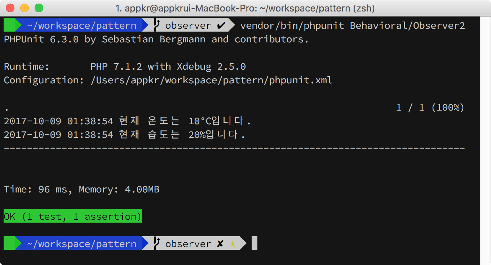
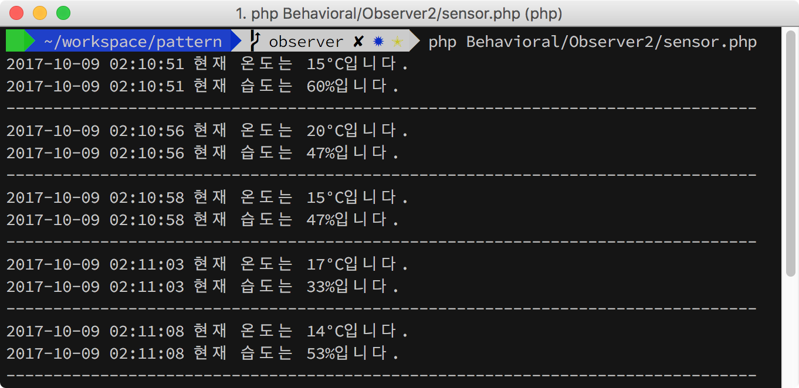
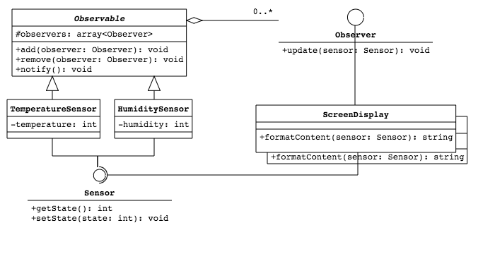
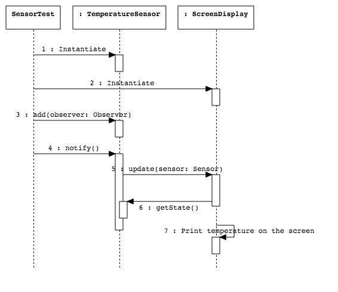

## Observer

A와 B 두 개의 객체가 있을 때, B가 A의 상태를 알고 싶다고 가정해보죠. 가장 쉬운 방법은 B가 주기적으로 A에게 물어보는 겁니다. "지금 너의 상태는 뭐니? 지난 물어봤을 때랑 데이터가 달라졌니?" 처럼요. 그런데 B처럼 A의 상태를 알고 싶어하는 객체가 1만개 정도이고, 1초에 한번씩 물어본다고 가정해보죠. 게다가 좀 더 극단적으로 A의 상태는 하루에 한 번 정도만 변경된다고 해보죠. 그럼 [(1만 객체 x 60회/분 x 60분 x 24시간) - 1만 유효 메시징] 만큼의 요청은 쓸 데없는 요청인 셈입니다. 폴링(polling) 방식의 문제점이죠.

반면에 푸쉬(push)방식을 살펴볼까요. A의 상태 변경을 알고 싶어하는 객체의 목록을 A가 가지고 있다면, A는 자신의 상태가 변경될 때 마다 목록에 등록된 객체들에게 변경 사실을 통지할 수 있을 겁니다. 이제 A는 자신의 상태가 변경됐을 때, 즉 하루에 딱 한번만 B와 그 친구들과의 메시지을 보냅니다. 낭비가 현격히 줄어든 셈이죠.   

앞서 언급한 푸쉬 방식을 위한 패턴이 Observer입니다. 이 예제에서는 온도와 습도 센서가 스크린 디스플레이 및 로그 기록장치와 메시징하는 시나리오입니다. 센서는 A, 디스플레이 및 로거는 B입니다. Observer 패턴에서 A를 Observable 또는 Subject라 하고, B를 Observer라고 부릅니다.  

### 1. 설치 및 실행

```bash
~/pattern $ composer install
~/pattern $ vendor/bin/phpunit Behavioral/Observer2 
```



센서의 값이 변경됐을 때만 디스플레이를 변경되는 시나리오를 흉내내기 위해 무한루프를 돌면서 랜덤으로 센서의 상태를 변경시키는 예제도 포함하고 있습니다. 아래처럼 실행할 수 있습니다.

```bash
~/pattern $ php Behavioral/Observer2/sensor.php
```



### 2. UML



`Observable` 타입은 `Observer` 타입을 집합으로 가지고 있고, 상태 변경을 알리고 싶을 때 `Observable.notify()`  함수 안에서 집합으로 등록된 `Observer` 객체를 순회하면서 `Observer.update(sensor: Sensor)` 함수를 호출합니다. 



이 예제 구현에서 `Sensor` 타입은 Observer 패턴과는 무관하지만, `Observer`로 부터 `update(sensor: Sensor)` 함수 콜을 받고, 인자로 넘겨 받은 `Sensor` 타입의 `getState()` 함수를 통해 센서의 상태를 조회하고, 디스플레이에 출력하거나 로그에 쓰는 역할을 하게됩니다.
