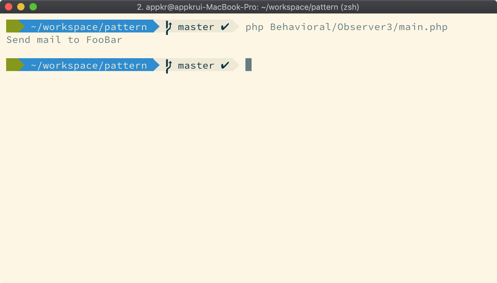

## Event

- 이벤트: "투수가 공을 던졌다"라는 사건
- 이벤트 핸들러: "투구" 이벤트에 대한 타자의 리액션
- 이벤트 데이터: 100Km/h 커브로 날아가는 "공"

#### Example
> 6f024c1 이벤트 이해하기 #6 - 실용적인 예제
> 회원 가입 이벤트가 발생하면 환영 이메일을 보낸다

- 이벤트: `UserRegisteredEvent`
- 이벤트 핸들러: `SendWelcomeEmail`
- 이벤트 데이터: `User`



#### 점진적 학습
상세 내용은 커밋 로그 참조. 각 커밋으로 체크아웃해서 실행해보세요.

```bash
$ git checkout eff3ed9
$ php Behavioral/Observer3/main.php
```

##### eff3ed9 이벤트 이해하기 #1 - 관찰자 패턴
관찰자 패턴, PubSub, 이벤트 용어 비교
- Observer - Subscriber - 이벤트 핸들러
- Observable(또는 Subject) - Publisher - 이벤트

##### 16bdaf3 이벤트 이해하기 #2 - 하나의 이벤트를 처리하는 다수의 핸들러
이벤트 하나에 대해 다수의 이벤트 핸들러가 작동하는 예제. 가령 투구 이벤트에 대해, 타자 뿐만아니라 심판, 해설자, 관중, 전광판 등등등 다양한 핸들러가 현실 세계에서도 작동함. 

##### b931c63 이벤트 이해하기 #3 - 이벤트와 핸들러 쌍, 9240d9f 이벤트 이해하기 #4 - 이벤트 디스패처
디스패처란 함수를 호출해주는 모듈. 컨트롤러 디스패처, 잡 디스패처, 이벤트 디스패처, 등등등. 이 예제에서는 이벤트에 해당하는 핸들러의 함수를 호출해 주는 클래스를 이벤트 디스패처라 함.

##### 3b66336 이벤트 이해하기 #5 - 이벤트 디스패처 기능 확장
이벤트 핸들러로 객체나 일급 함수(클로저)를 받을 수 있도록 기능 확장 
