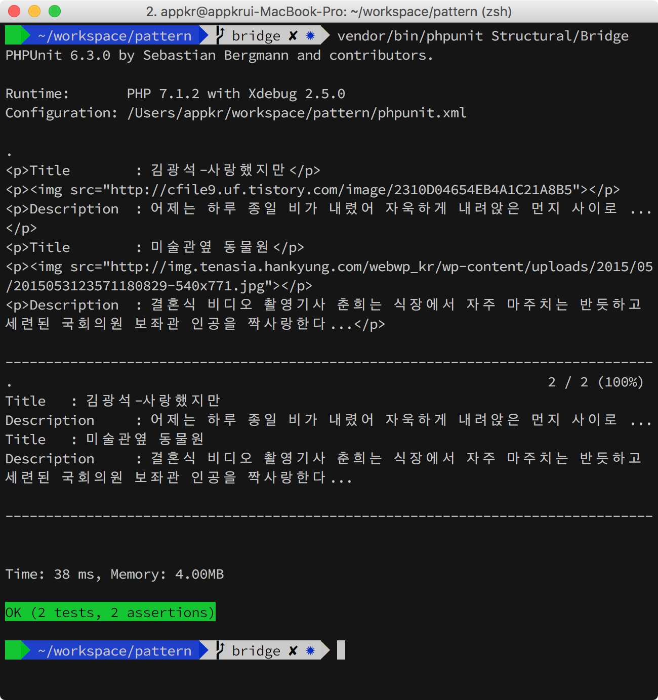
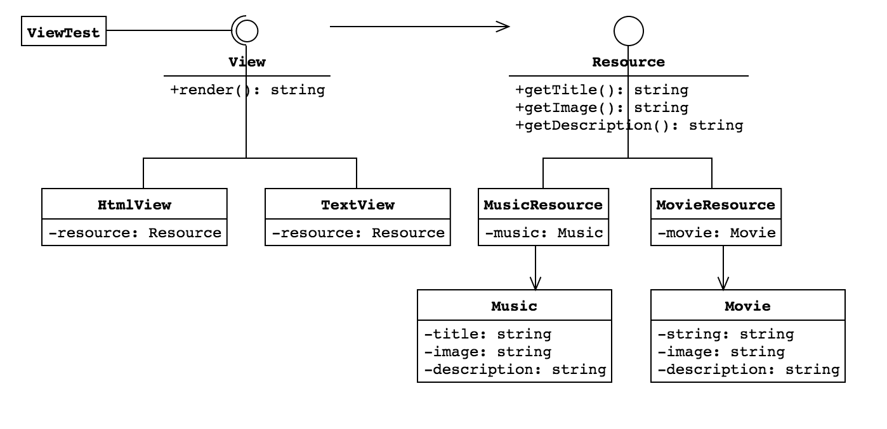

## Bridge

[곱집합(Cartesian Product)](https://en.wikipedia.org/wiki/Cartesian_product)이 발생하는 경우에 클래스의 개수를 현저히 줄일 수 있는 패턴입니다.

이 예제는 단순화를 위해 음악과 동영상만 가지고 있는 아이튠즈를 흉내내고 있습니다. 음악과 동영상을 표시하는 방법을 여러가지 일 수 있습니다. 

가령 뷰는 (A,B,C) 세 종류이고, 리소스는 (1,2,3) 세종류라 가정해 보죠. 그럼 리소스를 화면에 렌더링하기 위한 뷰 클래스는 (A,1), (A,2), (A,3), (B,1), (B,2), (B,3), (C,1), (C,2), (C,3) 총 아홉 개가 필요합니다.

브릿지 패턴을 이용하면 뷰 클래스 세 개, 리소스 클래스 세 개로 모든 조합을 표현할 수 있습니다. 

처음에 이런 의문이 들었습니다. '왜 `Music`과 `Movie` 모델에 직접 접근하면 될 것을 왜 `*Resource`라는 클래스에서 랩핑하고 있지?'. `*Resource` 클래스를 이용해서 프리젠테이션과 데이터를 분리시켜 뷰 요구사항 변경으로부터 모델을 보호할뿐더러, 모델마다 데이터 구조 또는 함수가 다를 때 `*Resource` 클래스가 어댑터 역할을 해 줍니다.

[위키피디아](https://en.wikipedia.org/wiki/Bridge_pattern)에서는 `View` 인터페이스를 ***Abstraction***, `HtmlView` 클래스를 ***RefinedAbstraction***, `Resource` 인터페이스를 ***Implementor***, `MusicResource` 클래스를 ***ConcreteImplementor*** 라 칭하고 있습니다.

### 1. 설치 및 실행

```bash
~/pattern $ composer install
~/pattern $ vendor/bin/phpunit Structural/Bridge
```



### 2. UML


