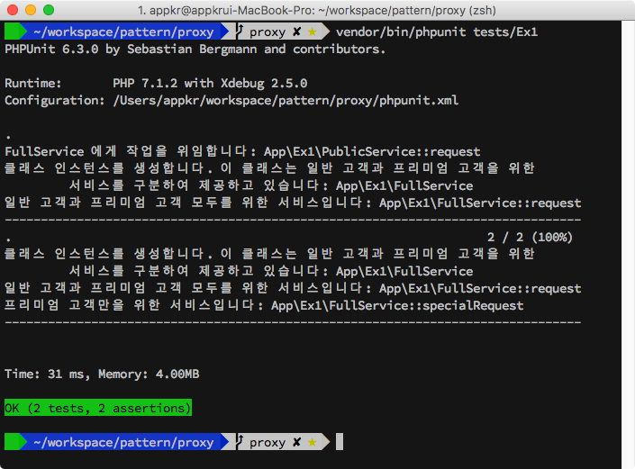
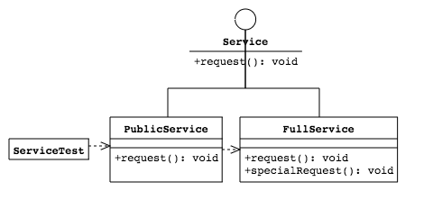
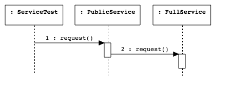
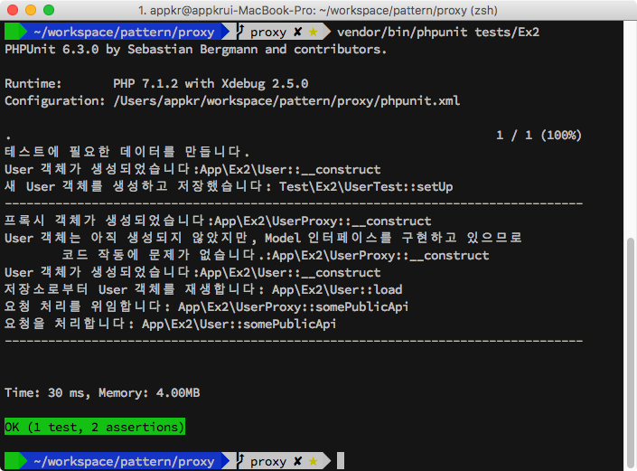
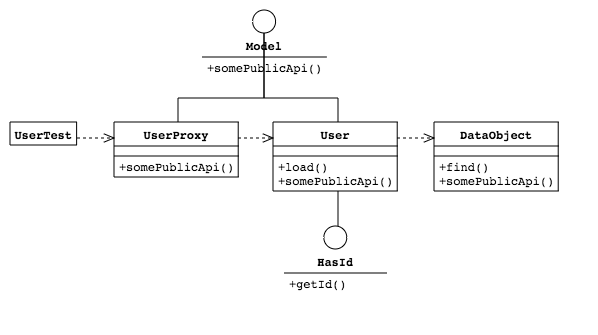
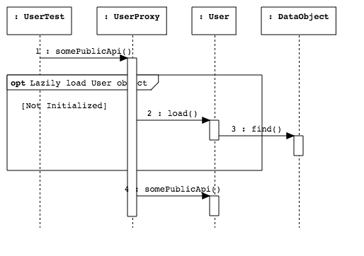

## Proxy & Lazy Loading

프록시(Proxy) 디자인 패턴의 작동을 연구하기 위한 프로젝트입니다.

### 1. 설치 및 실행

```bash
~/proxy $ composer install
~/proxy $ vendor/bin/phpunit
```

### 2. 시나리오 Ex1

프록시 객체를 이용해서 프리미엄 서비스를 보호하는 시나리오입니다. 

프리미엄 고객은 `FullService::request()`, `FullService::specialRequest()`를 둘 다 요청할 수 있지만, 일반 고객은 `FullService::request()`만 요청할 수 있습니다.







### 3. 시나리오 Ex2

생성하는데 비용이 비싼 객체를 지연 로딩하는 시나리오입니다. 예제에서는 데이터베이스에서 객체를 재생하는 시나리오를 시뮬레이션합니다. 

예제에서 `User`와 `UserProxy`는 모두 `Model` 인터페이스를 상속하고 있으므로, `Model` 인터페이스에 의존하는 코드에서 `UserProxy` 객체를 이용해도 아무 문제없이 작동합니다. `UserProxy`는 `User` 객체에 의존하는 가짜 객체이며, `somePublicApi()` 함수가 호출되기 전까지는 `User` 객체를 생성하지 않습니다. 구현하다보니 살짝 싱글톤 느낌이 되긴 했는데, `UserProxy::somePublicApi()` 함수 호출로 한번 생성된 `User` 객체는 `UserProxy`가 자신의 멤버 변수에 캐시하고 있습니다.






