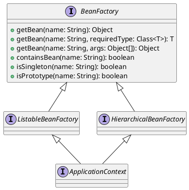

## Spring IoC (Spring Bean)

- module 1 @see https://www.baeldung.com/spring-bean
> In Spring, the objects that form the backbone of your application and that are managed by the Spring IoC container are called beans. A bean is an object that is instantiated, assembled, and otherwise managed by a Spring IoC container.

- module 2 @see https://www.baeldung.com/spring-getbean
```java
@Bean(name = {"tiger", "kitty"})
@Scope(value = "prototype")
Tiger getTiger(String name) {
  return new Tiger(name);
}

Tiger tiger = context.getBean(Tiger.class, "Shere Khan");
```

- module 3 @see https://www.baeldung.com/spring-factorybean @see https://spring.io/blog/2011/08/09/what-s-a-factorybean @see https://howtodoinjava.com/spring-core/how-to-create-beans-using-spring-factorybean/
> There are two kinds of beans in the Spring bean container: ordinary beans and factory beans. Spring uses the former directly, whereas latter can produce objects themselves, which are managed by the framework

> By extending the `AbstractFactoryBean` class, your factory bean can simply override the `createInstance()` method to create the target bean instance

- module 4 BeanFactory @see https://www.baeldung.com/spring-beanfactory
> It is important to point that BeanFactory does not support the Annotation-based dependency Injection whereas ApplicationContext, a superset of BeanFactory does


